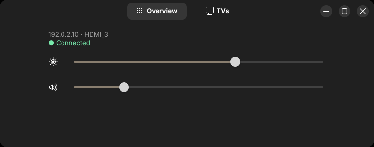

<p align="center">
  
</p>
<h1 align="center">LG Buddy</h1>
<p align="center">Make your LG webOS TV feel at home on your Linux desktop.</p>
<p align="center">
  <a href="https://github.com/Staphylococcus/LG_Buddy/releases">Download</a> ·
  <a href="docs/user-guide.md">User guide</a> ·
  <a href="CONTRIBUTING.md">Contribute</a>
</p>

LG Buddy handles your TV's power and panel alongside your PC, with everyday
controls close at hand.

## 1.6 Beta Preview

**1.6.0-beta.1** introduces Overview, the TVs view, and native first-TV pairing.
This is an early preview of 1.6; further GUI work is still being developed.
The released beta does not include GUI Settings. Development builds also include
TV input changes, local unpairing, and editable Settings controls. The latest
stable 1.5 release does not include this expanded interface. See the
[beta release notes](docs/releases/1.6.0-beta.1.md) for scope and installation
details. Current development builds also use the bare `lg-buddy` entrypoint for
normal Overview; the released beta's desktop entry still invokes `brightness`.
Screenshots use sample TV data.



Move a slider to apply its value, or click the sound icon to toggle mute.
[Take the GUI tour →](docs/user-guide.md#desktop-app)

- **Power with your PC.** Turn the TV on at boot and wake, and off at shutdown
  and before system sleep.
- **Give the panel a break.** Blank it when you're away, restore it when you
  return, and power off after five more minutes without activity.
- **Keep playing.** Supported gamepad activity keeps the panel awake.
- **Adjust from the desktop.** Change brightness and volume, toggle mute, and
  see connection status in Overview.
- **Pair your first TV.** Follow the pairing dialog, then view the TV's model
  and saved connection details in the TVs tab.

GNOME is not required. Official release bundles include prebuilt binaries, so
normal installation does not require a Rust toolchain. The stable CLI remains
available for headless controls, settings, and updates.

## Desktop Compatibility

| Functionality | GNOME | Compatible native Wayland | Wayland with `swayidle` | Other Linux sessions |
| --- | --- | --- | --- | --- |
| TV control at boot, shutdown, sleep, and wake | ✅ | ✅ | ✅ | ✅ |
| Idle blank and activity restore | ✅ | ✅ | ✅ | ❌ |
| Gamepad activity keeps the panel awake | ✅ | ✅ | ❌ | ❌ |
| Brightness, volume, settings, and update commands | ✅ | ✅ | ✅ | ✅ |
| Overview with brightness, volume, and mute | ✅ | ✅ | ✅ | ✅ |

The default `auto` backend prefers a complete GNOME session, then native
Wayland when the compositor provides `ext_idle_notifier_v1` version 2 or newer
and at least one seat. It uses `swayidle` only as a deprecated compatibility
fallback when native monitoring is unavailable. Inspect the decision with:

```bash
lg-buddy settings describe screen.backend
```

See the [user guide](docs/user-guide.md#automatic-screen-blanking) for backend
selection and troubleshooting. Protocol and event details are documented in the
[session backend model](docs/session-backend-model.md).

## Before You Install

Fresh installation selects the native `lg_webos` control path, which does not
require Python. Native-only packages can omit the Python client, `venv`, and
`pip`. The release-bundle installer still provisions `bscpylgtv` as an explicit
compatibility fallback, so it checks for Python 3 with a `venv` that provisions
`pip`, plus `zenity`. Official release bundles target the Ubuntu 24.04 runtime
baseline: GTK 4.14, libadwaita 1.5, and glibc 2.39 or newer. Before executing
the GUI, the installer checks the installed GTK and libadwaita runtime versions.
On apt, dnf, and pacman systems it can install the mapped runtime packages after
explicit confirmation; refusal and noninteractive operation without that opt-in
leave package installation to the user. The installer then verifies that the GUI
executable can load and has the same release identity as the runtime before
changing the LG Buddy installation.
Zenity remains the compatibility fallback for `lg-buddy brightness` when the
GUI executable is absent. The normal no-argument `lg-buddy` launch requires the
installed GUI.
`swayidle` is needed only by an existing explicit selection or as the deprecated
compatibility fallback.

### Debian, Ubuntu, and Pop!_OS

```bash
sudo apt install python3-venv python3-pip zenity libgtk-4-1 libadwaita-1-0
# Deprecated compatibility fallback only:
sudo apt install swayidle
```

### Fedora

```bash
sudo dnf install python3 python3-pip python3-virtualenv zenity gtk4 libadwaita
# Deprecated compatibility fallback only:
sudo dnf install swayidle
```

### Arch Linux

```bash
sudo pacman -S python python-pip python-virtualenv zenity gtk4 libadwaita
# Deprecated compatibility fallback only:
sudo pacman -S swayidle
```

Source builds also require a Rust toolchain and a working C toolchain because
the vendored D-Bus library is compiled during the build. See the
[development guide](docs/development.md) for build instructions.

## Install

1. Download and extract the [release archive](https://github.com/Staphylococcus/LG_Buddy/releases)
   for your platform.
2. Run the installer as your regular user:

```bash
chmod +x ./install.sh
./install.sh
```

Do not run the installer with `sudo`; it requests elevated access when needed.

The installer asks for the TV's IP address, MAC address, HDMI input, control
platform, and desktop idle preferences, then installs the required services.

Fresh setup defaults to the native `lg_webos` platform and verifies pairing
before saving the configuration, so accept the prompt on the TV. You can
instead select the explicit `bscpylgtv` compatibility fallback; its prompt may
appear on first use. See the
[bscpylgtv first-use guide](https://github.com/chros73/bscpylgtv/blob/master/docs/guides/first_use.md).

To check, verify, and install the next release from your saved update channel,
run `lg-buddy updates install` as your regular user. It checks host
compatibility, shows the exact target identity, asks for explicit confirmation,
and then runs the verified bundle's upgrade installer. Upgrade mode preserves
configuration and credentials and does not repeat setup or pairing;
incompatible and legacy layouts are refused rather than migrated.

`v1.4.0-beta.2` is the first release with `updates install`; older versions
need one normal manual release-bundle installation before assisted upgrades are
available.

The shell installer targets conventional Linux installations with mutable
system locations. First-class NixOS packaging is tracked in
[issue #24](https://github.com/Staphylococcus/LG_Buddy/issues/24).

## Quick Start

LG Buddy's services run automatically after installation. Open **LG Buddy**
from your app launcher to open the normal Overview. The desktop entry runs
`lg-buddy` with no arguments. For a brightness-focused Overview, run:

```bash
lg-buddy brightness
```

The command line also provides direct controls, settings, and updates:

```bash
lg-buddy brightness set 65
lg-buddy volume 20
lg-buddy volume mute
lg-buddy settings set screen.idle_timeout 600
lg-buddy updates check
lg-buddy updates install
```

Run `lg-buddy <command> --help` for scoped syntax; `lg-buddy --help` and
`lg-buddy help` show CLI help. To revisit the current interactive setup, run
`./configure.sh` from the extracted release archive. The complete GUI first-run,
service, and update journey remains tracked in
[issue #129](https://github.com/Staphylococcus/LG_Buddy/issues/129).

The [user guide](docs/user-guide.md) covers the desktop app, commands, settings,
service checks, and uninstalling.

## Documentation

- [User guide](docs/user-guide.md)
- [Development guide](docs/development.md)
- [Architecture overview](docs/architecture-overview.md)
- [Session backend model](docs/session-backend-model.md)
- [Gamepad activity subsystem](docs/gamepad-subsystem.md)
- [Defaults and configuration](docs/defaults-and-configuration.md)
- [Runtime event handler map](docs/runtime-event-handler-map.md)
- [Contributing](CONTRIBUTING.md)
- [Release process](docs/release-process.md)

## Credits

- [chros73](https://github.com/chros73) for `bscpylgtv`
- [JPersson77](https://github.com/JPersson77) for
  [LGTV Companion](https://github.com/JPersson77/LGTVCompanion), the original inspiration
- [Faceless3882](https://github.com/Faceless3882) for the original shell script
  implementation
