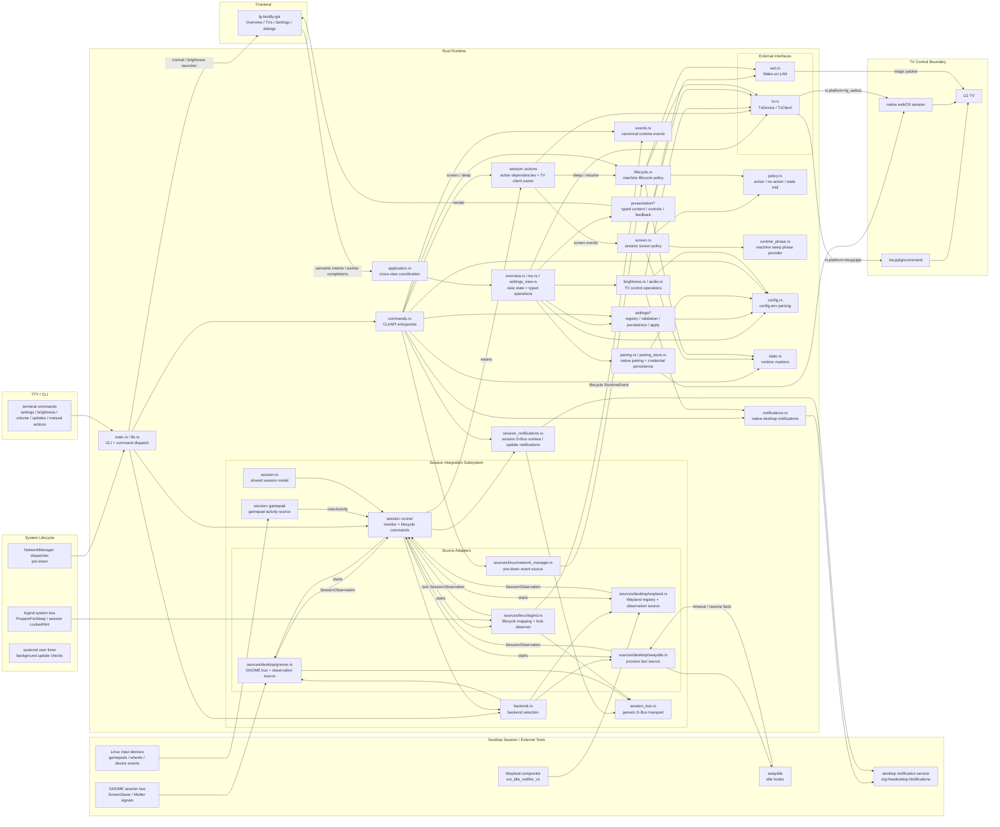

# LG Buddy Architecture Overview

This document describes the current LG Buddy architecture.

It is not a product roadmap. It is a map of what exists today and how the main pieces fit together.

For the top-level system, desktop, and service event paths that enter the
runtime, see [Runtime event handler map](runtime-event-handler-map.md).

For the current application-owned presentation contract and GTK renderer
boundary, see [Frontend architecture](gui-target-architecture.md).

## Repository Shape

The repository has one application/runtime crate, one GUI frontend crate, and
one setup surface:

- Rust runtime workspace
  - `Cargo.toml`
  - `crates/lg-buddy/`
  - `crates/lg-buddy-gui/`
- shell-based setup surface
  - `configure.sh`
  - `install.sh`
  - `uninstall.sh`
  - `bin/LG_Buddy_Common`
  - `systemd/`

The Rust application owns operational behavior and toolkit-neutral presentation
state. The GUI crate uses a libadwaita application/window shell and GTK widgets
to render that state. The remaining shell layer exists for configuration,
installation, and removal.

## High-Level Runtime Shape

The Rust crate is organized as a small core with explicit boundaries:

```text
main.rs
  -> lib.rs
     -> parse CLI arguments
     -> dispatch command
        -> commands.rs
           -> load config/state/dependencies
           -> sources/
              -> linux/logind.rs
              -> linux/network_manager.rs
              -> desktop/gnome.rs
              -> desktop/swayidle.rs
           -> events.rs
           -> screen.rs
           -> lifecycle.rs
           -> policy.rs
           -> runtime_phase.rs
           -> tv.rs / wol.rs / state.rs
```

## Semantic Abstraction Ladder

LG Buddy is organized as a semantic abstraction ladder. Each rung translates
implementation-specific observations and outcomes into a smaller, stable
semantic contract for the rung above. For example:

- G923 HID reports become gamepad control observations, then `UserActivity`,
  then inactivity decisions and screen actions.
- webOS messages and power states become TV operation outcomes, which screen
  and lifecycle policy use without knowing the underlying protocol.

Each rung owns the interpretation, validation, postcondition verification, and
recovery that are fully scoped to its abstraction. It exports stable semantics,
not its internal representation. Decisions that require broader product context
remain with the higher-level policy layer.

This confines complexity rather than bubbling it upward. If every low-level
detail reaches the top, policy must understand every device, provider,
transport, and platform quirk, making the core progressively harder to reason
about and change. Allowing each layer to operate at its own altitude limits how
much of the system any one component must understand, localizes changes and
tests, and lets new implementations satisfy existing contracts without teaching
policy their mechanics.

This is the project-wide application of information hiding, Design by Contract,
and separation of policy from mechanism. The session rule to unify providers
semantically rather than mechanically is one instance of this principle.

## System Diagram

The current runtime can be visualized as several consumer paths into the Rust
runtime, and then one control path from policy code into the TV transport
boundary.

The main runtime consumers are:

- system lifecycle and service integrations, including systemd,
  NetworkManager, and logind
- desktop environment and session integrations, including GNOME, native
  Wayland, `swayidle`, and Linux input activity sources
- TTY users invoking the CLI directly
- the installed `lg-buddy` launcher with no arguments, which opens normal
  Overview through the matching GTK executable
- the `lg-buddy brightness` launcher, which opens the matching GTK executable
  focused on brightness
- the `lg-buddy-gui` GTK window, which renders Overview, TVs, pairing, and
  Settings from typed application state and sends semantic user intents through
  the in-process Rust API



The current split is:

- `lib.rs`
  - public entry surface for the binary
  - command parsing
  - shared error types
- `commands.rs`
  - CLI/API command entrypoints
  - delegates screen and sleep actions to a short-lived runtime action owner
  - config, state, and dependency loading for other command execution
  - command output handoff
- `application.rs`
  - toolkit-neutral coordination between Overview, TVs, and Settings
  - cross-view refresh and operation availability after pairing, unpairing, or
    settings changes
- `overview.rs`, `tvs.rs`, and `settings_view.rs`
  - view state, semantic intents, typed operations, and completion handling
  - retry decisions, progress, cancellation boundaries, and stale-completion
    rejection
- `brightness.rs` and `audio.rs`
  - brightness and audio read/write operations over shared TV/config adapters
  - the brightness application contract and operation identities reused by
    Overview
- `pairing.rs` and `pairing_store.rs`
  - native webOS pairing and profile/credential persistence with rollback
- `settings/*`
  - the canonical settings registry, descriptions, validation, persistence, and
    runtime apply behavior shared by CLI and GUI
- `presentation/*`
  - typed screen content, values, availability, progress, and user-facing errors
  - brightness declarations reused inside the combined Overview presentation
- `crates/lg-buddy-gui/src/*`
  - persistent native widgets, navigation, focus, accessibility, and dialogs
  - workers that execute application operations and return typed completions
  - no separate validation, persistence, retry policy, or TV workflow
- `events.rs`
  - canonical runtime event envelope and source classification
- `policy.rs`
  - explicit policy outcomes: selected actions, no-action decisions,
    diagnostics, and state-transition trail
- `notifications.rs`
  - native desktop notification dispatch through
    `org.freedesktop.Notifications`
  - passive notification delivery for brightness
- `session_notifications.rs`
  - LG Buddy-owned user-session D-Bus surface for update notification handoff
  - session-owned update notification dispatch through
    `org.freedesktop.Notifications`
  - update notification action handling for `View Release` and automatic
    update-check opt-out
  - hosted by the user-session `monitor` process
- `screen.rs`
  - pure session screen blank and restore policy decisions over already-read
    observations
  - edge glue that reads runtime phase and TV state, applies marker
    transitions, renders output, and dispatches TV/Wake-on-LAN effects
  - session marker ownership rules
  - screen restore policy and retry behavior for screen actions
- `lifecycle.rs`
  - pure startup, shutdown, system sleep pre-action, NetworkManager sleep-gate,
    and system resume decisions over already-read observations
  - edge glue that reads reboot state, TV state, and marker state, applies
    marker transitions, renders output, dispatches TV/Wake-on-LAN effects, and
    performs retry/backoff
  - locked, idempotent pre-sleep attempt handling
  - system marker ownership rules
- `runtime_phase.rs`
  - source-agnostic machine sleep phase read used by screen policy
  - Linux implementation reads logind `PreparingForSleep`
- `config.rs`
  - config path resolution
  - parsing of the existing `config.env` format
  - typed values for HDMI input, backend, MAC address, and idle timeout
- `state.rs`
  - runtime directory resolution
  - system/session state separation
  - ownership marker management
- `upgrade_preflight.rs`
  - observes whether the current release-bundle installation can be replaced
    safely
  - returns structured, actionable refusals without downloading or mutating
    anything
  - provides separate installed-runtime and verified-candidate entrypoints
- `tv.rs`
  - TV transport abstraction
  - profile-bound `bscpylgtvcommand` adapter
  - configured selection between the compatibility and native adapters
  - adapter-neutral errors and selected-client construction
  - typed facade for input, screen, power, brightness, and audio operations
- `web_os/adapter.rs`
  - profile-bound native webOS adapter
  - lazy authenticated session ownership, serialization, reuse, and invalidation
- `web_os/audio.rs`
  - typed native SSAP volume and mute requests and responses
- `wol.rs`
  - native Wake-on-LAN packet generation and UDP send
- `backend.rs`
  - backend selection and detection
  - `auto`, `gnome`, native `wayland`, and deprecated `swayidle` compatibility
- `session.rs`
  - backend-neutral session event model
  - normalized source-observation boundary
  - top-level event consumption is mapped separately in
    [runtime-event-handler-map.md](runtime-event-handler-map.md)
- `session/inactivity.rs`
  - owns the configured inactivity deadline and fixed five-minute post-blank
    power-off deadline
  - resets the deadline from normalized activity observations and blanks when
    it expires
  - arms power-off only after confirmed blank success and cancels it on activity
  - keeps blank and restore decisions edge-triggered instead of poll-triggered
- `session/gamepad/`
  - discovers readable Linux gamepad-like input devices
  - refreshes discovery from Linux input-device add, remove, and change events
  - periodically reconciles the watched device set in case an event is missed
  - maps raw controller events into activity observations
  - hosts device-specific adapters for supplemental activity surfaces
  - includes a Logitech G923 adapter for raw HID wheel and pedal reports that
    may not appear through evdev
  - detailed in [gamepad-subsystem.md](gamepad-subsystem.md)
- `session_bus.rs`
  - generic blocking D-Bus transport seam
  - consumed by the GNOME and logind source adapters
- `session/runner.rs`
  - backend-neutral monitor and lifecycle runners
  - starts the user-session notification surface before screen backend work
  - keeps the user-session process alive when idle blanking is disabled or a
    screen backend is temporarily unavailable
  - combines backend observations with the inactivity engine
  - dispatches semantic session events into screen and lifecycle policy
  - starts source workers and multiplexes their normalized observations
- `session/actions.rs`
  - shared dependency assembly for screen and sleep actions
  - retains the native TV client across compatible events in each monitor
  - reloads configuration and replaces clients when their target or operation
    policy changes
- `sources/linux/logind.rs`
  - Linux system lifecycle and current-session lock-state adapter
  - maps `org.freedesktop.login1` resume signals into canonical lifecycle
    events
  - reads the `PreparingForSleep` property used by the NetworkManager pre-down
    gate
  - owns the optional lock observer: system-bus connection, graphical-session
    resolution, subscriptions, owner rebinding, and `LockedHint` translation
- `sources/linux/network_manager.rs`
  - NetworkManager `pre-down` dispatcher source
  - emits `NetworkTeardownImminent` with the logind sleep-phase reading
- `sources/desktop/gnome.rs`
  - owns GNOME session-bus setup, subscriptions, sender validation, Mutter
    user-active watches, and translation into normalized observations
- `inhibition.rs`
  - independent push inhibition contract, Boolean aggregation and diagnostics;
    standalone until the monitor integration in #225
- `sources/desktop/gnome/inhibition.rs`
  - SessionManager inhibition subscriptions, state refresh and recovery,
    independent of GNOME activity
- `sources/desktop/wayland.rs`
  - native Wayland capability probing and dynamic registry/seat ownership
  - maps zero-timeout resumed notifications into desktop activity facts
- `sources/desktop/swayidle.rs`
  - owns the production `swayidle` process and translates timeout/resume
    callbacks into idle/activity facts

The session-facing pieces should be read as one subsystem:

- `backend.rs`
  - selects the active session backend
- `session.rs`
  - defines canonical session events and normalized source observations
- `session/inactivity.rs`
  - owns session-phase synthesis and the configured inactivity deadline
- `session/gamepad/`
  - supplies auxiliary user-activity observations for controller input
  - owns gamepad device discovery, event-triggered refresh, and reconciliation
  - see [gamepad-subsystem.md](gamepad-subsystem.md) for adapter and lifecycle details
- `session/runner.rs`
  - owns shared session orchestration, including source selection,
    worker lifetime, multiplexing, and gamepad activity
  - converts provider and auxiliary input into activity observations, resets
    the inactivity deadline, and dispatches source-classified runtime policy
  - treats `screen_idle_blank=disabled` as a passive user-session mode that
    preserves update notification handoff without TV idle blank/restore actions
  - consumes `swayidle` timeout/resume facts through the same inactivity policy
  - owns the `lifecycle` event loop for system sleep/wake handling
- `sources/linux/logind.rs`
  - adapts Linux system lifecycle signals and owns observation of an eligible
    graphical session's `LockedHint`
- `sources/desktop/gnome.rs`, `sources/desktop/wayland.rs`, and
  `sources/desktop/swayidle.rs`
  - own their provider-specific connection or process mechanics and expose
    normalized observations to the runner

## Command Model

The intended public user-action surface is:

- `power on`
- `power off`
- `brightness`
- `brightness get`
- `brightness set <0-100>`
- `volume`
- `volume <0-100>`
- `volume up`
- `volume down`
- `volume mute [on|off]`
- `screen off`
- `screen on`
- `settings list`
- `settings describe [KEY]`
- `settings get <KEY>`
- `settings set <KEY> <VALUE>`
- `settings unset <KEY>`
- `updates check [--notify]`
- `updates install`

The installed application entrypoint is `lg-buddy` with no arguments. It
locates `lg-buddy-gui` beside the runtime and launches it with no arguments for
normal Overview. `lg-buddy-gui` with no arguments has the same normal Overview
behavior. `lg-buddy brightness` remains a brightness-focused deep link;
`lg-buddy --help` and `lg-buddy help` remain CLI help. These launch routes do
not change the operational CLI, service, or update paths listed above.

The binary also retains package-owned and compatibility entrypoints during the
public-surface migration:

- `startup [auto|boot|wake]`
- `shutdown`
- `sleep-pre`
- `sleep`
- `nm-pre-down`
- `screen-off`
- `screen-on`
- `monitor`
- `lifecycle`
- `detect-backend`
- `updates background-check`

`lib.rs` parses the command line into a typed command enum and dispatches into
the runtime command handlers in `commands.rs` and `session/runner.rs`.
Screen and sleep actions share dependency assembly in `session/actions.rs`:
monitors retain one action owner, while one-shot commands create a fresh owner.
The owner delegates decisions to the screen and lifecycle domain modules;
platform ingestion belongs to `sources/`. The on-demand
`updates check` command reads the saved `updates.channel` policy and consumes
the GitHub Releases API without entering the screen, lifecycle, or scheduling
paths. `updates install` adds the user-confirmed upgrade orchestration: initial
host preflight, fresh settings-driven discovery, target identity resolution,
explicit terminal confirmation, verified bundle acquisition, candidate
preflight, direct `install.sh --upgrade` execution, and installed identity
verification. The verified bundle and acquisition lock remain owned until the
installer and final verification finish. `updates background-check` is the
timer-owned wrapper: it exits before GitHub/cache work when
`updates.auto_check` is disabled and otherwise delegates to the same
settings-driven check path with notification intent enabled. When notification
is requested and an update is available, the one-shot CLI process hands the
resolved update facts to the LG Buddy-owned user-session D-Bus surface. The
running session process then owns desktop notification dispatch, notification
ids, the `View Release` action, and the notification opt-out action. The
opt-out action persists `updates.auto_check=disabled` through the settings API,
which also disables/stops the installed update-check timer. The update command
owns an operational cache under the user cache directory for GitHub ETag,
latest release metadata, and last-notified release state used by the observable
update notification policy; that cache is not user configuration and is not
part of the settings API.

The installer supplies the matching runtime and GTK executable together, checks
GTK/libadwaita versions, and offers to install missing runtime packages before
proceeding. The no-argument `lg-buddy` command locates `lg-buddy-gui` beside the
running CLI and launches its no-argument entrypoint for normal Overview.
The `brightness` command locates the same executable and launches its
`brightness` entrypoint, which selects the brightness control even when another
view is already open. The `brightness get` and `brightness set` commands never
enter either launcher and use the TV picture abstraction in `tv.rs` for typed
OLED brightness validation and live TV read/write operations. The GTK entrypoint
opens one Overview alongside the primary TV summary, volume, and mute.
Two icon-and-slider rows submit changes as the sliders move; the sound
icon toggles mute. The core Overview application owns its declarations and semantic
intents; GTK renders them without adding TV or configuration policy. Workers
keep blocking operations off the GTK main loop. Capability state is independent,
and opaque operation identity prevents late results from replacing newer or
closed presentation state. Successful changes keep Overview open; brightness
writes retain the existing success notification. Passive native operations use
stored credentials without opening pairing prompts.
The TVs tab reads the existing primary profile and local credential state
through application-owned operations, then enriches the display name with a
separate optional model read from the TV. The application owns navigation and TV
selection; GTK supplies the native view switcher and adaptive layout. Zero TVs
produces a blank state, one TV opens directly to details, and only multi-profile
renderer fixtures expose the TV-selection sidebar. Production storage remains
limited to one primary profile. Tab changes retain pending Overview operations
and do not initiate TV writes or pairing.
The TVs application also declares immediate managed-input changes and confirmed
local unpairing. Input edits reuse the settings registry, persistence, and apply
strategy. Unpairing shares the pairing store’s lock and atomic config publication,
removes only primary-profile keys and the local native token, and restores that
token if config publication fails. Compatibility credential storage and unrelated
settings are retained. A started change disables profile controls and suspends
Overview operations; completion reloads Overview with new operation identities.
Active Overview writes must finish before profile changes can begin. GTK only
renders the input selection, confirmation, progress availability, and errors.
The zero-TV blank state offers first-TV pairing through a separate foreground
application workflow. GTK forwards the native webOS form and cancellation
intents, and worker progress describes connecting, TV confirmation, verification,
and saving. Validation, protocol authentication, capability checks, and credential
persistence remain in the core. Pairing is refused as root. The access token
stays in memory until verification succeeds; the primary profile is published
last, with credential rollback on a failed save. Accepted cancellation prevents
publication. Once saving begins, it finishes even if the window closes.
The toolkit-independent application coordinator opens the new TV details and
refreshes Overview with fresh operation identities after success. The application
backend selects the capability checks; the webOS client supplies authentication
and cancellable reads. GTK forwards unexpected worker termination to the core
as an internal failure. This does not install or activate services.

Settings reads the seven behavior settings from the shared registry, including
their descriptions, value choices, and validation. Toggle and choice changes
submit immediately; the numeric timeout commits on Enter or focus loss.
`SettingsApplication` serializes mutations through the same persistence and
runtime apply path as the CLI. Successful changes are silent. Validation and
persistence failures restore the prior value; an apply failure retains the
saved value and offers a retry of the runtime step. Missing or inactive services
are reported after the apply attempt, rather than monitored continuously.
Persistent native rows keep focus and layout stable across refreshes. About is
a native informational dialog reached from the main menu.

The `volume` family uses the TV audio abstraction for typed volume and mute
operations. Setting or stepping volume explicitly unmutes after the volume
operation; mute toggle reads the current state before writing its inverse.

This keeps CLI parsing separate from operational behavior.

## Release Bundle Acquisition Boundary

`release_bundle.rs` turns a selected GitHub release into an owned, verified
candidate without invoking its installer. Acquisition refreshes the selected
tag directly from the fixed LG Buddy repository instead of trusting cached
asset metadata, resolves the tag to a bounded immutable commit, and requires
exactly one Linux-musl archive and one checksum asset.

Asset downloads use fixed GitHub API URLs, bounded bodies and deadlines, and an
explicit one-hop HTTPS release-asset redirect policy. Both assets must match
GitHub's SHA-256 digest and declared size; the archive digest must also match
the single corresponding entry in `sha256sums.txt`.

The process holds a nonblocking filesystem lock while staging under a private
user-cache directory. It scans the complete archive before extraction,
rejecting path aliases, traversal, links, special files, duplicate entries,
unsafe modes, excessive sizes, and unexpected layout. The manifest must agree
with the release, target, and resolved commit. The extracted ELF is never run:
its build-generated, linker-retained identity record is parsed as data and must
independently agree on version, channel, target, tag, and commit. The returned
guard owns the verified candidate and removes its staging tree when dropped;
no executable, installer, sudo, or configuration action runs in this boundary.

## Host Upgrade Safety Boundary

`upgrade_preflight.rs` checks observable host and installation state. It does
not infer upgrade support from the distribution name, a build flag, an install
receipt, or where the binary originally came from.

The initial preflight expects the running binary to be the mutable
`/usr/bin/lg-buddy` installation. It checks the conventional release-bundle
filesystem topology, ordinary file and directory types, ownership, writable
mounts, config-pointer discovery, readable configuration state, user and system
integrations, systemd manager availability, and the absence of legacy layouts
that would require migration. Each path is tied to the upgrade
operation that consumes it: file replacement, executable replacement,
directory mutation, read-only input, or exact drop-in replacement. Those
policies carry their ownership, permission, link, mount, and containment
invariants. Symlinks, mounted or multiply linked replacement targets,
untrusted writable system paths, unexpected systemd drop-ins, read-only
mutation targets, and special files in owned config state are refused.

After a bundle has been verified, its candidate binary can run the second
preflight. That pass rechecks the installed state, proves it is executing the
candidate from the supplied bundle root, and checks the candidate manifest,
installer, runtime, GUI executable, desktop entry, and systemd assets before
any privileged mutation. The first GUI upgrade permits the installed GUI to be
absent; once present, it must satisfy the same safe executable-replacement
policy as the runtime. Candidate inputs must be owner-usable and not writable
by another user. The installer also runs both candidates' non-graphical version
paths and requires exact release identity agreement before mutation. The
external ancestor chain must remain root- or user-owned and cannot be
shared-writable unless sticky-directory semantics protect its trusted child.
Configuration and pairing scripts are deliberately excluded because the
non-interactive upgrade mode preserves existing configuration and credentials
without invoking them.

The installer reads the existing platform choice before dependency installation.
A healthy legacy environment is preserved with a final deprecation notice; an
unhealthy one is refused with the native pairing command before privileged
mutation. Native upgrades run a second candidate preflight for removal of the
obsolete `/usr/bin/LG_Buddy_PIP` directory. It rejects unsafe roots and nested
mounts before removal. Configuration and credentials remain unchanged.

Fresh installation never provisions Python. GTK/libadwaita requirements are
checked through the bundled GUI's internal `--check-runtime` entrypoint, which
reads the loaded library versions without initializing a display. A failed
probe prompts for the distribution's GTK/libadwaita packages and is repeated
before binary identity validation and installation.

These checks are a conservative, evolving safety boundary, not an exhaustive
host-support declaration or a promise that no later privileged operation can
fail. New observable checks can be added as real installations expose unsafe
conditions; callers only consume the structured compatibility result.

## Core Control Flows

### `screen off`

`screen off` is an idle policy action.

Flow:

1. Load config.
2. Resolve the session state marker path.
3. For session-originated events, read the runtime sleep phase through
   `runtime_phase.rs`.
4. If machine sleep is pending and lifecycle automation is enabled, record a
   no-action decision and do not touch the TV.
5. Query the TV's current input.
6. If the configured HDMI input is active:
   - try to blank the screen
   - if blanking fails, fall back to `power_off`
   - create the ownership marker on success
7. If another input is active:
   - clear the marker
   - do nothing to the TV

After a successful automatic blank, the inactivity engine starts a fixed
five-minute grace period. Activity cancels it before restore. At expiry,
`screen.rs` rechecks that automatic blanking is enabled, the session marker is
present, the configured input is still active, and machine lifecycle allows a
session action. It then attempts `power_off` once and preserves the marker for
later activity restore. Input mismatch clears ownership; input-query failure
skips without a blind power-off fallback. A monitor restart with an existing
marker starts a fresh grace period.

### `screen on`

`screen on` is a resume policy action.

Flow:

1. Load config.
2. Resolve the session marker.
3. For session-originated events, read the runtime sleep phase through
   `runtime_phase.rs`.
4. If machine sleep is pending and lifecycle automation is enabled, record a
   no-action decision and do not touch the TV.
5. Apply `screen_restore_policy`:
   - `conservative`: skip if the marker is missing
   - `aggressive`: continue even without the marker
6. Try the adapter-neutral screen-unblank operation.
7. On failure, fall back to Wake-on-LAN plus repeated input-restore attempts.
8. If input restore reports that the screen is not visible, unblank it and retry
   the input so the complete restore is verified.
9. Clear the marker on success.
10. Leave the marker in place if wake recovery fails.

### `startup`

`startup` handles both cold-boot and wake restoration behavior.

Flow:

1. Load config.
2. Resolve the system-scope marker.
3. Decide behavior from `StartupMode` and `screen_restore_policy`:
   - `boot`: always restore
   - `wake`: restore only when policy allows it
   - `auto`: treat marker presence as wake, otherwise boot
4. Clear the marker before attempting restore.
5. Send Wake-on-LAN.
6. Retry `set_input` until the TV is reachable on the configured HDMI input or attempts are exhausted.

### `shutdown`

`shutdown` is a guard-rail policy action.

Flow:

1. Load config.
2. Ask `systemctl list-jobs` whether a reboot is pending.
3. If reboot is pending, skip TV power-off.
4. Otherwise query current input.
5. If the configured HDMI input is active, issue `power_off`.
6. If input query fails, still attempt `power_off`.
7. Power-off failures are logged but do not abort shutdown handling.

### `lifecycle`

`lifecycle` is the system sleep/wake event loop. Linux pre-sleep TV power-off is
owned by one cooperative suspend rail that accepts both logind
`PrepareForSleep(true)` and NetworkManager `pre-down` opportunities.

Flow:

1. Load config and suppress lifecycle TV actions while
   `system_sleep_wake_policy=disabled`.
2. Open the system bus.
3. Subscribe to logind `PrepareForSleep` signals.
4. On `PrepareForSleep(true)`:
   - enter the central suspend rail under the logind delay inhibitor
   - run one bounded pre-sleep TV decision unless another source already owns
     or completed the cycle
5. On `PrepareForSleep(false)`:
   - run wake restore policy from the canonical logind resume event
   - clear sleep-cycle coordination state
6. If config is changed to disable lifecycle handling while the service is
   running, stop the lifecycle monitor cleanly.

The NetworkManager pre-down gate runs `lg-buddy nm-pre-down`. That command reads
logind `PreparingForSleep`; false or read failure returns quickly, true runs an
idempotent pre-sleep rail before NetworkManager tears down the interface. If
logind already owns the cycle, NetworkManager waits for a terminal rail outcome
or bounded timeout before releasing teardown.

### Hidden `detect-backend` compatibility entrypoint

`detect-backend` resolves the desktop backend to use for existing package
callers. It is hidden from public help while those callers migrate to the
shared settings/backend presentation.

Selection order:

1. `LG_BUDDY_SCREEN_BACKEND` override if present
2. `screen_backend` from config
3. default to `auto`

Detection behavior:

- `auto` prefers GNOME when the current session satisfies the full GNOME contract and the session bus is reachable
- native `wayland` validates `ext_idle_notifier_v1` version 2 or newer plus at
  least one advertised seat; explicit selection does not fall back
- `auto` prefers complete GNOME, then compatible native Wayland, then the
  deprecated `swayidle` compatibility backend when installed
- other forced backends validate their required services or commands

## TV Integration Boundary

The TV layer is intentionally split into two levels:

- low-level transport trait: `TvClient`
- higher-level domain facade: `TvDevice`

`TvClient` models adapter-neutral operations for one configured TV profile. The
target address and implementation-specific credential context are bound when a
client is constructed; policy cannot redirect a client by passing an address to
an operation.

The current contract covers:

- `current_input`
- `set_input`
- `oled_brightness`
- `set_oled_brightness`
- `audio_status`
- `set_volume`
- `volume_up`
- `volume_down`
- `set_muted`
- `power_off`
- `blank_screen`
- `unblank_screen`

`TvDevice` provides a more readable surface to policy code:

- `tv.input().current()`
- `tv.input().set(...)`
- `tv.screen().blank()`
- `tv.screen().unblank()`
- `tv.power().off()`
- `tv.power().wake(...)`
- `tv.picture().oled_brightness()`
- `tv.picture().set_oled_brightness(...)`
- `tv.audio().status()`
- `tv.audio().set_volume(...)`
- `tv.audio().volume_up()` / `tv.audio().volume_down()`
- `tv.audio().set_muted(...)`

Successful effectful operations return no transport-specific output. Failures
are normalized into typed TV errors. Policy may react to adapter-neutral
outcomes such as the screen not being visible, but transport and platform state
remain inside the adapter. Wake-on-LAN keeps the configured network identity at
`TvDevice`; adapter operations do not accept targeting data.

### TV Implementations

`tv.platform` selects the production TV implementation. Fresh profiles select
the native Rust `lg_webos` implementation and verify pairing before the profile
is saved. Existing profiles retain their explicit choice; a missing platform
value continues to resolve to `bscpylgtv` and is materialized as that
compatibility choice when configuration is rewritten. `bscpylgtvcommand`
remains available as an explicit fallback.

The Rust runtime talks to it through `BscpylgtvCommandClient`, which:

- belongs to one configured TV address
- shells out to the configured command path
- keeps subprocess output and exit status inside the legacy adapter
- maps reads and failures into the shared domain contract
- privately verifies screen visibility after input restore and screen unblank

`SelectedTvClient` is the internal delegation point for the configured legacy
or native implementation. `WebOsTvClient` owns one lazily authenticated
websocket session behind a mutex, reuses it while healthy, and discards it after
transport or framing failure. Native effectful operations verify their own
postconditions before reporting success. After an ambiguous failure the adapter
may reconnect for safe read-only verification, but it never replays the
effectful operation. The legacy adapter performs its equivalent power-state
readback through `bscpylgtvcommand`; neither implementation exposes webOS power
states to policy code.

Each monitor's `RuntimeActionExecutor` retains this adapter across compatible
events. Client construction and connection remain lazy: starting a monitor
does not contact the TV. The owner reloads configuration for every action and
replaces its client when the profile path, TV address, MAC, platform, or client
options change. Unrelated settings changes preserve the connection. Client
options keep foreground pairing and timeouts separate from unattended suspend
and resume operations. Legacy clients are rebuilt per action, and one-shot
commands drop their owner on completion. A consumed or invalidated native
session reconnects on demand; there is no background connection maintenance.

If an input query invalidates a reused session, the adapter retries that read
once on a fresh connection before returning a failure to policy. This prevents
a socket closed between events from triggering the screen-off fallback without
checking the TV's current input. Fresh-session failures return normally, and
effectful operations are never replayed by this recovery path.

Native picture settings have two known service-invocation paths. A direct SSAP
write sends `ssap://settings/setSystemSettings` on the websocket. The Luna path
uses that same websocket to create and close a temporary notification alert;
the alert callback invokes
`luna://com.webos.settingsservice/setSystemSettings` inside the TV. Luna is
therefore not a second network transport.

LG Buddy uses only the alert-backed Luna path for brightness writes. It does not
try direct SSAP first, select a path from detected firmware, or fall back between
the two. Direct SSAP is rejected on affected firmware, while the Luna path is
the one supported by both evidence-backed firmware profiles. The direct path
remains represented in tests only so the mock can preserve the observed
firmware difference.

Keeping native TV control within the Rust runtime removes the Python client
from that selected operation path. This is useful groundwork for declarative or
immutable distributions such as NixOS, but it is not yet first-class NixOS
installation support. The shell installer still provisions the compatibility
fallback and writes conventional mutable system locations; alternative install
layouts are tracked in
[issue #24](https://github.com/Staphylococcus/LG_Buddy/issues/24).

## State Model

State is intentionally small.

The runtime currently uses two ownership markers:

- `screen_off_by_us` in session scope
- `screen_off_by_us` in system scope

The ownership markers answer one question:

- did LG Buddy blank or power off the TV as part of its own policy?

It does not answer whether restore should always be blocked.
In `aggressive` mode, restore may proceed even when the marker is absent.
When the system-scope marker exists after a sleep pre-action, session screen
actions defer to the lifecycle resume path while `system_sleep_wake_policy` is
enabled. The lifecycle path keeps that marker present while it waits for network
readiness and attempts input restore, then clears it after success or exhausted
restore attempts.

There are two scopes:

- `System`
  - default path under `/run/lg_buddy`
- `Session`
  - default path under `$XDG_RUNTIME_DIR/lg_buddy`
  - fallback under `/run/user/<uid>/lg_buddy`

This is a direct replacement for the earlier ad hoc script coordination pattern.

The cooperative suspend rail uses system-scope lock and cycle state files to
prevent concurrent pre-sleep handlers from racing each other. Repeated hooks are
expected to be safe through idempotent TV policy and persisted terminal cycle
outcomes.

## Desktop Backend Strategy

Desktop backends are treated as adapters, not owners of policy.

The automatic monitor composes available GNOME and Wayland activity sources.
Each adapter lives for the application lifetime, manages its own connections,
and contributes validated observations with their original time.
`session/activity.rs` bounds pending observations without tracking connections or
invalidating facts on connection loss. The runner queries adapter activity
availability separately for idle policy and diagnostics. The compatibility backend resolver still serves
existing settings/CLI callers; it does not select the automatic native source
set. See [Session backend model](session-backend-model.md) for the current
contracts and the temporary dev-only absence of native inhibition honoring
between #221 and #225.

Adapters may expose activity and inhibition independently, each through push or
pull according to the source. The standalone push inhibition section (#222)
combines maintained Boolean permissions with diagnostics. Its GNOME capability
requires only SessionManager and keeps subscriptions, state queries and owner
recovery internal. It contributes no activity observations. #225 connects the
two paths only at the `can_blank()` decision; runtime honoring remains absent
until then.

The runtime core owns:

- config
- state
- TV control
- Wake-on-LAN
- retries and recovery behavior
- lifecycle decisions

Desktop source modules should only answer questions like:

- how is the selected provider connected or started?
- which native signals or activity facts are valid?
- how should those facts map into normalized observations?

`session.rs` defines the backend-neutral semantic contract:

- canonical session events
  - `Idle`
  - `Active`
  - `WakeRequested`
  - `UserActivity`
  - `BeforeSleep`
  - `AfterResume`
  - `Lock`
  - `Unlock`
- a normalized observation carrying its source and observation time

The detailed session model is documented in `docs/session-backend-model.md`.

`sources/desktop/gnome.rs` is the native GNOME adapter. It currently provides:

- the GNOME session-bus connection and subscriptions
- ScreenSaver sender ownership validation and signal mapping
- Mutter user-active watches independent of inhibition, and normalized activity
  observations

`sources/desktop/wayland.rs` is the native Wayland adapter. It owns the
Wayland connection, registry, every advertised seat, and zero-timeout idle
notifications. Resumed notifications become desktop activity observations in
the shared inactivity runtime; compositor idle does not directly blank the TV.

`sources/desktop/swayidle.rs` is the compatibility process adapter. Its timeout
callback publishes `Idle`; its resume callback publishes independent desktop
activity. The adapter does not invoke TV-facing commands or own screen policy.

The session subsystem is intentionally asymmetric where the providers are
asymmetric:

- the current GNOME provider treats ScreenSaver active/wake and recent Mutter
  input as activity that resets LG Buddy's inactivity deadline; ScreenSaver
  idle is not a blanking authority
- the shared session runtime consumes gamepad activity directly from
  Linux input devices as `AuxiliaryInput`, independently of desktop providers;
  every enabled monitor backend uses this runtime
- the same runtime opportunistically observes `LockedHint` on the current
  graphical logind session; lock requests the normal session blank policy,
  unlock is informational, fresh independent activity can restore while locked
  after the fixed one-second post-lock grace, and logind owner changes trigger
  session rebinding and reconciliation; failure or lack of support does not
  affect the selected desktop backend
- the gamepad source refreshes its device set from Linux device add, remove, and
  change events, with periodic reconciliation for missed events
- `swayidle` timeout and resume callbacks feed the shared inactivity engine
- system lifecycle is handled by the NetworkManager pre-down gate plus logind
  lifecycle service, while lock state is optional in the shared session runtime

`swayidle` remains an explicit and automatic compatibility fallback during the
1.x migration window, but emits a deprecation notice and is not offered by
fresh interactive configuration. Removal is planned for 2.0.0 after native
Wayland remains field-validated across supported compositors and unsupported
sessions have precise diagnostics.

## Configuration and Override Surface

The runtime is designed to be testable and relocatable.

Important environment overrides:

- `LG_BUDDY_CONFIG`
  - explicit config file path
- `LG_BUDDY_SCREEN_BACKEND`
  - force backend selection
- `LG_BUDDY_BSCPYLGTV_COMMAND`
  - override TV command path
- `LG_BUDDY_GUI`
  - override the matching `lg-buddy-gui` path for relocation and tests
- `LG_BUDDY_SYSTEM_RUNTIME_DIR`
  - override system state directory
- `LG_BUDDY_SESSION_RUNTIME_DIR`
  - override session state directory
- `LG_BUDDY_SYSTEMCTL`
  - override the `systemctl` command path used by shutdown logic

These exist mainly so the runtime can be tested without mutating real system paths or depending on globally installed commands.

## Testing Shape

The test strategy has three layers:

- unit tests for parsing, state, backend selection, and policy
- subprocess-backed integration tests for TV behavior
- manual hardware probes when exact external behavior is unclear

TV-facing tests exercise the production protocol boundaries instead of relying
only on in-memory fakes. The compatibility adapter uses a stateful subprocess
mock, while the native adapter uses a centralized stateful webOS test server.

Relevant test assets:

- `tools/mock_bscpylgtvcommand.py`
- `crates/lg-buddy/tests/support/mod.rs`
- `crates/lg-buddy/tests/mock_bscpylgtvcommand.rs`
- `crates/lg-buddy/src/web_os/test_support/test_server.rs`
- `crates/lg-buddy/src/web_os/observed_behavior.rs`
- `crates/lg-buddy/tests/features/webos.feature`

The legacy mock preserves the command and response shapes observed from the
installed client. Native behavior claimed as real is linked to hardware
evidence and modeled by the centralized server; defensive protocol faults are
identified separately. See [Native webOS testing](webos-testing.md).

## Current Boundary

The Rust runtime currently owns:

- config loading
- state handling
- TV abstraction
- Wake-on-LAN
- backend detection
- startup
- shutdown
- system lifecycle handling through the cooperative logind/NetworkManager
  suspend rail plus logind resume monitor
- screen off
- screen on
- brightness control
- volume and mute control
- application coordination for Overview, TVs, native pairing, and Settings
- TV profile and credential persistence, including confirmed unpairing
- the shared settings registry, validation, persistence, and runtime apply path
- `monitor` command with GNOME, native Wayland, and `swayidle` paths

The shell layer still owns:

- interactive configuration
- installation
- uninstallation

What is still not implemented:

- additional desktop backends
- an immutable-distribution install layout that avoids conventional `/usr`
  writes

The no-argument launcher opens the installed application, while the shell layer
remains the explicit setup, installation, and uninstallation surface for
headless use. v1.7.0 extends the GUI with the complete first-run, service
activation, update, and troubleshooting journey under
[issue #129](https://github.com/Staphylococcus/LG_Buddy/issues/129). The
application owns typed runtime/service and update state, including on-demand
diagnostics; the GUI renders those states without inferring policy. A resolved
screen backend display is not a GUI requirement, and the existing CLI paths
remain available. The current architecture is a Rust-owned runtime and
application with a thin GTK renderer and shell setup surface. See
[Frontend architecture](gui-target-architecture.md) for the current view and
renderer boundaries.
