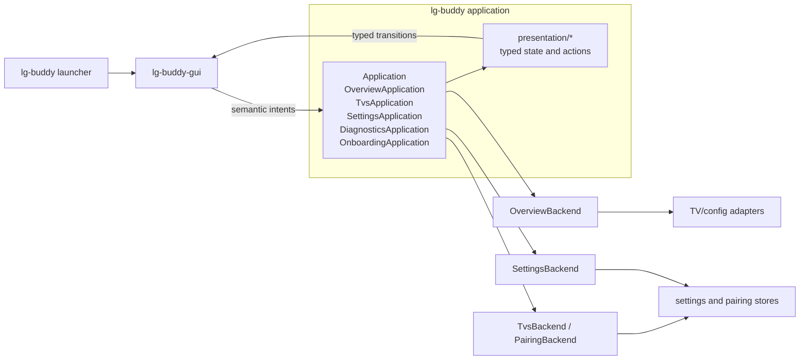

# LG Buddy Frontend Architecture

This document describes the current first-party Linux frontend in the
development tree. The application and GUI are a single Rust workspace, with
the application owning state and the GTK crate rendering it.

> The frontend covers Overview, TVs, Settings, first-TV pairing,
> About, manual update checks, user-confirmed release-bundle installation in
> Settings, and shared onboarding for TV pairing and required services. Desired
> settings survive failed or cancelled setup. The app menu
> provides on-demand diagnostics with report viewing, refresh, copying, and
> saving.

## Boundary



`crates/lg-buddy` is GTK-free. It owns validation, application state,
operation identities, persistence, TV operations, and user-facing error
normalization. `crates/lg-buddy-gui` owns the libadwaita application, native
widgets, focus, dialogs, and the worker-to-main-loop bridge. GTK callbacks do
not load configuration, call a TV, invoke the CLI, or decide workflow state.

The shared setup contract is documented in [Shared onboarding and setup
completion](onboarding.md). CLI and GUI consume its backend-owned steps and
flow. The GUI reuses the pairing modal as a segmented wrapper, entered from
the unchanged **Pair a TV** prompt or the Settings **Complete setup** row.
An independent read-only startup assessment supplies the current setup status.
Steps return uniform structured outcomes and own domain error handling and
recovery. The flow composes those outcomes and forwards requests; it does not
interpret step-specific errors or implement their fallback policies.
The flow owns execution context and permits one active flow across CLI and GUI.
Setup steps are independently testable but only pairing remains separately
accessible. Steps report and enforce whether they are currently cancelable;
the flow and frontends respect that decision.
Startup assessment composes the same granular status checks used by step
execution, so service and integration readiness rules have a single owner.

The contract is in-process Rust data. It is not JSON, a widget tree, a daemon
protocol, or a versioned transport. The composition root may construct the
application and renderer together, but product decisions remain in the
application modules.

## Current repository shape

The frontend boundary follows the actual modules:

```text
crates/lg-buddy/src/
  application.rs                 cross-view coordinator and transitions
  navigation.rs                  Overview, TVs, Settings destinations
  overview.rs                    Overview state, intents, operations
  tvs.rs                         TV collection, selection, and management
  pairing.rs                     first-TV pairing workflow and persistence
  pairing_store.rs               profile/token persistence and rollback
  setup/gui.rs                   onboarding presentation and worker operations
  settings_view.rs               Settings state, intents, and mutations
  presentation/
    overview.rs                  summary, brightness, audio declarations
    brightness.rs                shared brightness declaration and errors
    tvs.rs                       TV list/details/actions declaration
    pairing.rs                   pairing form/stage declaration
    settings.rs                  settings groups, editors, and feedback

crates/lg-buddy-gui/src/
  lib.rs                         application controller and workers
  window.rs                      Adwaita window, navigation, About dialog
  overview.rs                    Overview widgets and slider rendering
  tvs.rs                         TV details, adaptive list, and unpair dialog
  pairing.rs                     reusable TV connection form
  onboarding.rs                  shared setup modal and step rendering
  settings.rs                    native settings rows and editors
```

There is no GUI `brightness.rs` renderer. Brightness is a control in
`OverviewView`; its toolkit-neutral declaration is shared from
`presentation/brightness.rs`.

## Entrypoints and headless commands

The installed `lg-buddy` command with no arguments launches the matching
`lg-buddy-gui` with no arguments and opens Overview. The GUI's `brightness`
entrypoint reactivates the existing application instance and focuses the
brightness slider, including when TVs or Settings is selected. Repeated
activation keeps one window.

`lg-buddy brightness get` and `lg-buddy brightness set <0-100>` are direct
headless TV operations. The bare `lg-buddy brightness` command is the
brightness-focused GUI entrypoint. The release bundle ships the matching GTK
executable for both graphical launch paths. Installation owns providing that
executable and satisfying its GTK/libadwaita runtime requirements.

Other supported headless user commands remain independent of GTK:

- `volume get`, `volume set`, `volume up`, `volume down`, and `volume mute`
- `power on` and `power off`
- `screen off` and `screen on`
- `settings list`, `describe`, `get`, `set`, and `unset`
- `updates check` and `updates install`
- `--help`, `help`, and `--version`

Service, lifecycle, backend-selection, and release-preflight commands also
remain headless runtime paths. They are not GUI screens.

## Typed presentation and intents

`Application::open` creates an `ApplicationTransition` containing the opening
transitions for Overview, TVs, and Settings. Each transition carries a typed
presentation plus zero or more opaque operation identities. The GUI renders
the presentation, starts the declared operations on workers, and sends their
typed completions back to `Application`.

The application exposes concrete screen models rather than a general widget
schema. These are the current presentation types and renderer-facing intents:

| View | Presentation owned by `lg-buddy` | Intents emitted by the GTK surface |
| --- | --- | --- |
| Overview | `OverviewPresentation` containing `TvSummaryPresentation`, `BrightnessPresentation`, and `AudioPresentation`; brightness/audio status is `Loading`, `Ready`, `Applying`, or `Failed(UserFacingError)`. | `OverviewIntent::SetBrightness(u8)`, `SetVolume(u8)`, `SetMuted(bool)`, `RetryBrightness`, `RetryAudio`, `RetrySummary`, and `Cancel`. |
| TVs | `TvsPresentation` with `TvsStatus`, `Vec<TvProfile>`, selected `TvId`, actions, and optional `PairingPresentation`. | `TvsIntent::Select`, `Retry`, `PairTv`, `SetInput`, `UnpairTv`, `ConfirmUnpair`, `CancelUnpair`, `RetryInputApply`, and `Pairing`. |
| Onboarding | `OnboardingPresentation` with backend-selected step content, an optional `PairingPresentation`, action, progress and cancellation state. | `OnboardingIntent::Open`, `SetAddress`, `SetMac`, `SetInput`, `Submit`, and `Cancel`. |
| Settings | `SettingsPresentation` with `SettingsGroup` and `SettingsRow` values; rows use `SettingsEditor` and `SettingsCommitPolicy`. | `SettingsIntent::Retry`, `SetEnabled`, `Commit`, and `RetryApply`; `Refresh` is requested by application navigation on entry. |

`OverviewTransition`, `TvsTransition`, and `SettingsTransition` carry these
presentations and typed operation identities. `OverviewFrontendUpdate` also
declares whether Overview remains presented or closes.

`UserFacingError` carries the safe summary/detail text displayed by GTK.
Transition diagnostics are logged separately by the controller and may retain
implementation detail; storage paths, credentials, protocol frames, and debug
error representations do not cross into the displayed presentation.

## Views and navigation

The top-level `ApplicationPage` enum contains exactly three destinations:
Overview, TVs, and Settings. `window.rs` maps them to an `adw::ViewStack`, an
`adw::ViewSwitcher`, and a narrow-window `adw::ViewSwitcherBar`. The
application owns the selected page; GTK reports page changes to the
controller, which selects the page in `Application` and renders the resulting
state.

The coordinator initially shows the TVs loading view while reading local profiles.
No saved TV means TVs-only mode, with both desktop and narrow navigation hidden.
The app menu remains available. Pairing reveals normal navigation; unpairing
returns to TVs-only mode without changing unrelated settings. An offline saved
TV keeps normal navigation. A failed configuration read keeps Settings reachable
and shows a read error rather than an empty pairing prompt.

With a saved TV, Overview is the normal root. It shows the primary TV summary and connection
state, OLED pixel brightness, TV volume, and mute. It has no separate Apply or
Cancel workflow: moving a slider emits `SetBrightness` or `SetVolume`, and
changing the sound button emits `SetMuted`. Writes remain asynchronous and
Overview stays open after success. The latest slider value is retained and
coalesced if another write is already running. Independent brightness and audio
read states make unavailable control capabilities actionable without changing
the rest of the view.

The TVs view reads local profile and credential metadata. Production storage
currently represents zero or one configured TV, while the renderer supports
multiple profiles for the application model and renderer scenarios. More than
one profile uses an adaptive `AdwNavigationSplitView`; zero or one uses a
single details/blank view. Selection is application state. A separate bounded
model-name read may replace the profile heading, but it does not rewrite the
profile.

The zero-TV blank state exposes **Pair a TV**, which opens the shared onboarding
modal. The extracted form forwards address, MAC and input edits to
`setup::gui::OnboardingApplication`. Workers keep the `OnboardingFlow` alive
between responses, including authorization and additional dependency consent.
Only the flow decides which step comes next and when setup is complete.

Pairing verifies the TV and saves its profile before the service and integration
steps. Cancellation consults the live flow gate. Accepted cancellation retains
completed work; noncancelable mutations keep the modal and application open.
Closing the modal refreshes TV, Overview and Settings state, including when a
later step was cancelled. No post-pairing behavior-toggle queue remains.

The Settings **Complete setup** row consumes backend `SetupStatus`. Flow
observations and independent assessment update that status. Checks refresh on
window reactivation, entering Settings, and after setup or configuration mutations.
Older results cannot overwrite a newer flow observation. Both entry points open the same modal and re-inspect current state.

Fresh graphical installation deploys binaries and repair payloads, creates an
empty configuration only when absent, and opens the existing **Pair a TV**
prompt. Onboarding owns subsequent service setup. Existing-installation refresh
and release-upgrade paths retain their deployment responsibilities.

Settings is built from the existing registry-backed `SettingsStore`. It shows
three groups—Screen, Sleep & Wake, and Updates—with seven behavior settings.
Rows declare one of the native editors `Toggle`, `Choice`, or `Number`, and a
commit policy of `OnChange` or `OnFinalize`. Toggles and choices apply on
change. The idle-timeout number commits on Enter or focus loss. Accepted
changes are validated, persisted, and applied automatically; writes are
serialized in application state, with accepted edits queued in order. There is
no Save or Cancel button.

The application presentation hides Desktop integration and Idle timeout when
Idle blanking is explicitly disabled. GTK retains the native rows and their
values while hiding them; Restore policy remains visible because it also
governs restoration outside idle blanking. Invalid blanking values keep the
dependent controls available for diagnosis.

Settings exposes one native update row in the Updates group.
`SettingsPresentation::updater()` projects its title, installed version,
and **Check for updates** or **Install update…** action. While a check runs, its
button is disabled and labeled **Checking…**. Completed checks use the saved
channel and report only whether an update is available. The check retains no
release version, URL, or installation target. A channel change requires a fresh
availability check. Checking neither installs an update nor changes preferences
or sends a desktop notification.

`SettingsTransition::update_notice()` carries one-time completion feedback:
already-current results, check errors, cache warnings, and installation errors.
The window presents a toast with **Copy details** for failures. Refreshing or
rerendering Settings does not replay notices, while a repeated failed operation
produces a new notice. Toast actions copy the bounded, redacted details captured
for that particular completion.

**Install update…** opens an `adw::Dialog` with confirmation, release link,
current status, native progress bar, and the applicable action buttons.
Opening the dialog expresses intent to upgrade. Preparation reads the current
saved channel and independently selects its latest qualifying release. That
result supplies the confirmation version and release link, even if a newer
release appeared since the availability check. If no newer release qualifies,
the dialog closes, the row returns to **Check for updates**, and an **Already up
to date** toast appears. The modal resolves the release identity before
confirmation. Confirmation authorizes acquisition and installation of that
exact release; later release changes cannot replace it.

`update_flow.rs` owns preparation, explicit confirmation, cancellation,
progress, failures, and handoff; `update_install.rs` shares discovery, pinned
identity, acquisition, compatibility, and installation with the CLI. GTK only
renders these facts and forwards semantic intents. The progress bar pulses
while work is pending; no percentage is invented. Dismissal requests application
cancellation, which checks the actual installer boundary. Settings and TV
profile changes stay unavailable during installation.

The updater action occupies the same row as its status, using native text
spacing. Empty warning prefixes are detached so ordinary setting labels retain
the same left edge.

The installer runs as the regular user. Its graphical upgrade mode requests
one `pkexec` authorization for the existing system-file and system-service
operations. User service/configuration work remains unprivileged. Cancellation
uses an atomic boundary before invoking the installer; after that, the window
stays open for the result. Verified success replaces the current GUI process
with the installed GUI. The incumbent allows standard GApplication replacement,
and the successor requests it so bus-name teardown cannot turn the new process
into a remote activation. Normal launches still reuse the existing window.
A failed process replacement closes the progress dialog and shows a failure
toast. The Settings row identifies that a restart is required; its installation
action retries process replacement without reinstalling.

The application retains bounded failure details for the current session,
including across retries and Settings refreshes. Credential-bearing lines,
URLs, and control characters are removed before retention. The error toast
provides the details on demand, and the application presentation retains them
for the diagnostics readout independently of launcher stderr handling.

Resolved screen backend, service health, and runtime observations belong in
Diagnostics. Normal successful setting changes
are silent. Feedback appears
when a read, validation, persistence, or runtime apply result needs attention;
an apply warning keeps the saved value and can offer **Retry apply**.

## Diagnostics

The app menu's **Diagnostics** action is available before pairing, including
when navigation tabs are hidden. It opens a native dialog and starts a read-only
snapshot. **Refresh** collects again; **Copy** and **Save…** export exactly the
bounded, sanitized report shown in the dialog. A failed refresh retains the
previous report and collection time. File chooser cancellation is silent, and
save failures leave the report available to copy or save elsewhere.

`diagnostics.rs` collects build identity, typed effective settings, desktop
capabilities, separate systemd state fields, TV observations, and bounded recent
failure findings. Unavailable observations remain explicit partial results.
Capability probes are not treated as proof of what a running service uses; TV
connectivity is not proof of automation. Raw configuration values, credentials,
protocol frames, and journal messages are excluded from the report.
Native TV model reads require stored credentials. Compatibility profiles expose
local credential metadata only, because that backend cannot guarantee a model
read without initiating pairing.

`diagnostics_view.rs` owns collection, export snapshots, and stale-completion
handling. `Application` adds retained user-facing failures from the current GUI
session. The GTK controller runs workers, writes the clipboard, and selects a
save destination; the dialog renders report and action state. Closing it
invalidates pending UI completions, while an accepted file export can finish.
There is no automatic collection or generic repair action.

The main menu's **About LG Buddy** action is implemented by the native
`adw::AboutDialog`. It supplies the application name and icon, version, links,
credits, license, and build information. About is a window action rather than
a destination in `ApplicationPage`.

## Rendering invariants

Each view creates its native widget set once. Later presentations update the
existing widgets, preserving layout, editor drafts, selection, and focus where
the application state allows it. Rendering is guarded against signal
feedback: setting a slider, toggle, combo row, or entry from a presentation
does not emit a new user intent.

The renderer uses GTK/libadwaita controls and system behavior:

- Overview uses native horizontal scales and a toggle button.
- TVs uses status pages, action rows, a combo row, an adaptive split view, and
  an alert dialog for unpair confirmation.
- Onboarding uses an `adw::Dialog`, the grouped TV form, a native spinner,
  and backend-selected actions and cancellation state.
- Settings uses an `adw::PreferencesPage`, preference groups, switch rows,
  combo rows, and action rows.
- Errors and actionable warnings use accessible alert/status presentation;
  ordinary successful changes do not add noise.

The renderer keeps user focus meaningful. The brightness deep link can request
brightness focus after reactivation; a deferred initial focus request yields
to an explicit focus choice made by the user or by navigation. Settings keeps
an entry draft and caret stable while a completion refreshes the row. Pairing
focuses the address field when the dialog opens, and TVs restores focus after
unpair confirmation closes. Native dialog dismissal routes through the same
application intent as an explicit Cancel action.

Onboarding displays the backend's progress message and a spinner while work
runs. Dismissal follows the step's live cancellation gate. Pairing success
advances to remaining setup in the same modal; closing it reloads the other
views from the saved state.

## Workers, stale completions, cancellation, and persistence

GTK objects stay on the main thread. `ApplicationController` runs Overview
reads/writes, TV profile/model reads, TV management, onboarding, and Settings
reads/writes on worker threads. GLib timers deliver progress and typed results
from worker channels to the main loop. The controller reports unexpected worker
termination to the application for failure handling.

Every asynchronous read or operation carries an opaque operation identity.
Application state accepts a completion only when it is still the active
operation for that view and selection. This rejects results from a retry,
profile change, closed view, or earlier selection. A late result cannot reopen
a view, replace a newer editor value, or report success for the wrong request.
Renderer focus and draft preservation are separate invariants tested while
applying the current presentation; stale application results are never
rendered into that path.

Closing the window sends `OverviewIntent::Cancel`; application policy decides
when the models can shut down. Cancellation stops accepting new work and invalidates old
reads. A TV write or settings mutation already accepted by a worker is not
undone by closing; the window may close while the controller keeps the
application alive until that worker settles, then ignores any stale UI
transition. During onboarding, both modal dismissal and application quit
consult the live step gate. A noncancelable step rejects the request and keeps
the window open. Accepted cancellation waits for running work to settle before
closing, preserving completed steps and the flow's exclusion lock.

Persistence remains application-owned:

- Overview reads and writes through the existing TV and configuration
  adapters; it does not persist presentation data.
- TV input changes and unpairing use the existing settings and pairing stores.
- Pairing verifies in memory, then commits the native token and primary TV
  configuration through `PairingStore`.
- Settings uses the shared settings mutation executor. A validation or
  persistence failure restores the previous row. If saving succeeds but
  runtime application fails, the saved value remains and the row exposes
  **Retry apply**.

GTK never writes these files directly and never treats a matching widget value
as proof that a TV or service accepted an operation.

## Platform baseline and checks

The source uses GTK 4.10 APIs and libadwaita 1.5 APIs. Official release
bundles use Ubuntu 24.04 as the oldest build/runtime baseline (GTK 4.14 and
glibc 2.39). Fedora and current Arch smoke-test the same GUI artifact on
newer supported userspaces.

The relevant checks are:

- GTK-free application and presentation tests in `crates/lg-buddy`;
- GUI renderer scenarios for Overview, TVs, pairing, Settings, focus, and
  signal suppression;
- display-backed launch smoke for no-argument Overview and brightness
  reactivation, including one-window and focus behavior;
- installed-GUI and release-bundle smoke for the runtime/GUI pair, desktop
  entry, native controls, accessibility, and user-state preservation;
- the Fedora and Arch package/dependency smoke lanes used by release CI.

Screenshots can support visual review, but semantic controls, accessibility
state, typed intents, and application outcomes are the frontend contracts.

## Enduring rules

Keep presentation types concrete and application-owned. Add a new field when a
renderer needs a semantic fact; do not teach GTK to parse configuration keys,
transport errors, service commands, or update policy. Reuse existing domain
operations and the shared settings executor. Add application tests for state
and operation decisions before renderer assertions. Keep the headless CLI and
service paths GTK-free.

The frontend grew from the brightness MVP tracked in [issue #127](https://github.com/Staphylococcus/LG_Buddy/issues/127), but the current
architecture is the shared Overview/application coordinator described here.
