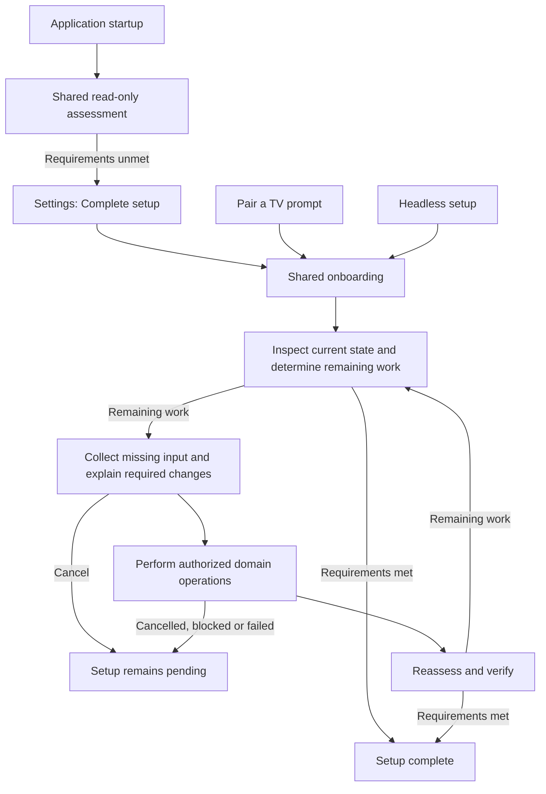

# Shared onboarding and setup completion

This document defines LG Buddy's setup contract and how the application implements
it. The [user guide](user-guide.md) describes using setup; the
[testing strategy](testing-strategy.md) describes how its guarantees are verified.

## Setup contract

LG Buddy has one backend-owned onboarding flow, shared by initial graphical
setup, headless setup, and completion of an existing installation. It accepts
the user's current state, completes the applicable remaining work, and verifies
the result. Repeating it with the same desired state and environment performs
no unnecessary changes or authorization requests.

Desired state comes from product requirements, the current environment, and
actual behavior settings. Observed state comes from inspecting the system.
The difference determines the work remaining.

**Basic services and required integrations are not separate user preferences.**
If a component is needed and its requirements are unmet, setup is incomplete.
Cancelling authorization does not mean the user wanted that component disabled.
There is no service opt-out, remembered integration decline, or "don't ask again"
setting that makes an unmet requirement disappear.

Existing behavior toggles retain their meaning. Their values are not rewritten
to hide failed or cancelled setup. Installation requirements and activation
requirements are distinct: disabling a TV behavior does not by itself remove
the need for a service that also provides other application functions.

Requirements are specific to the environment. A GNOME-only system does not
require a KWin bridge. An applicable Plasma Wayland installation with a missing
bridge has remaining setup work. A change of desktop, installed software, or
configuration can change the requirements after an earlier successful setup.

Missing native sources remain supported reduced coverage at runtime. That does
not make an applicable unmet setup requirement complete. LG Buddy keeps using
available capabilities while setup remains pending. The KWin progression is a
compatible prebuilt, matching local compilation, then operation without a KWin
source if neither works. That last outcome provides runtime resilience, not
verification that KWin setup succeeded.

## User experience

Initial setup presents **Pair a TV**. Its action and the Settings **Complete
setup** row open the same modal, containing the backend-defined pairing,
background services and applicable integration segments. An existing paired TV
proceeds directly to its remaining service or integration work. The application
supports zero or one configured TV.

The modal is implemented by the [GTK onboarding view](../crates/lg-buddy-gui/src/onboarding.rs),
which embeds the TV form. The toolkit-independent
[onboarding controller](../crates/lg-buddy/src/setup/gui.rs) owns its state, input
and worker operations. GTK renders the returned state; it does not decide step
order, readiness or completion.

A bounded, asynchronous, read-only assessment runs on application startup. It
does not install anything, change settings, initiate pairing, request
administrator authorization, or open onboarding. When applicable requirements
are unmet, Settings shows the neutral **Complete setup** row. The row reflects
backend status and disappears when current observations confirm completion.

The flow explains each required change and its purpose before requesting
authorization. Plasma setup explains that the integration allows LG Buddy to
recognize apps' requests to keep the TV on. System authorization dialogs identify
LG Buddy and the operation in human-readable terms. If a local build needs
compiler or development packages, the flow requests separate consent for them.

When authorization is not granted, setup explains that permission is needed and
offers retry or cancellation with completion later. An authorization failure
is not assumed to be deliberate cancellation: the system agent can report the
same result for dismissal, denial or unavailable authorization. Technical details
remain in diagnostics; the user-facing message describes the available action.

Each step reports and enforces whether its current operation is cancelable.
The flow and both frontends respect that decision, including modal close
requests. They do not force or queue cancellation of a noncancelable operation.
Accepted cancellation stops the attempt and further fallback authorization
requests. Completed work remains in place, and **Complete setup** remains
available for unfinished requirements. There are no unsolicited login password
prompts or automatic authorization retries.

Headless setup presents the same requirements, explanations and outcomes through
the terminal. Noninteractive execution uses supplied inputs and existing
authorization. If it cannot complete a required step, it reports remaining work
without opening a graphical prompt or reporting full completion.

## Assessment and execution

### Step ownership

The backend owns concrete, independently testable steps for pairing, services
and Plasma integration. Their common [response contract](../crates/lg-buddy/src/setup.rs)
distinguishes completion, inapplicability, required input or action, running work,
cancellation, blocked work and failure. Progress includes current cancelability;
failures include a user-facing explanation, technical diagnostic and retryability.
A successful command alone does not establish completion: the step verifies the
result through its own inspection.

Each step owns its validation, error handling, recovery, fallbacks and
verification. It translates domain errors into the common contract. Neither the
flow nor a frontend parses diagnostic prose, subprocess output or domain error
types to decide what happens next. Domain-specific input remains typed and is
forwarded by the flow to the appropriate step.

The same granular inspections serve flow planning, execution verification and
independent startup assessment. Repeating a completed step performs no additional
pairing, installation, configuration writes or authorization. Re-entry derives
remaining work from current facts, not a wizard page index or a persistent
"setup complete" flag.

Setup execution is exposed through the flow, with pairing retaining its
standalone entry point. Service and integration steps have no independent CLI
or GUI setup commands. Internal settings activation can use the narrower
[installed-service steps](../crates/lg-buddy/src/setup/services.rs) when enabling
a behavior; installation and repair remain the onboarding flow's responsibility.

### Domain inspections and operations

| Component | Readiness and implementation |
| --- | --- |
| TV pairing | The [pairing step](../crates/lg-buddy/src/setup/pairing.rs) checks the saved profile and credentials locally. It reuses native verification and persistence when pairing is needed. A sleeping or unreachable TV does not itself require pairing again. |
| Background services | The [service repair step](../crates/lg-buddy/src/setup/provision.rs) checks required files, ownership, configuration bindings, enablement and activity. System changes use the fixed [privileged helper](../data/setup-services.sh); user files are managed in the user's configuration directory. |
| Screen monitor | Its configuration must match the selected configuration and the service must be active. An enabled unit alone is insufficient. |
| Update checks | The timer follows the saved update setting. Its associated service need not run continuously. Invalid update preferences fail inspection before service or file changes. |
| Plasma integration | The [KWin step](../crates/lg-buddy/src/setup/kwin.rs) inspects applicability and verifies the live bridge and compatibility. A plugin file or old setup receipt is insufficient. Explicit provisioning uses [the KWin helper](../data/kwin/setup.sh), including prebuilt selection, local compilation and separate dependency consent. |

Service repair stops an installed service before replacing its unit files or
reloading configuration, then starts it with the new configuration. If repair
is interrupted, the inactive service keeps setup incomplete even when files and
systemd's loaded configuration already match. Saved TV settings and credentials
are retained across repair, cancellation and retry.

Service-property inspection uses the standard systemd user bus independently
of the selected desktop bus. Failed inspection cannot erase a requirement or
become proof of completion.

### Flow composition and coordination

[OnboardingFlow](../crates/lg-buddy/src/setup/flow.rs) composes the steps in the
fixed order **pairing → services → Plasma integration**, skipping verified or
inapplicable work. Saving the TV configuration before activating its consumers
requires no general dependency graph. Steps continue to validate their own
inputs and current state.

The flow is a synchronous worker API. Frontends open it with an authorization
mode, render a snapshot, and submit an answer with that snapshot's opaque token.
Each call executes at most the current step. The backend owns completion;
frontends cannot inject successful step results. Tokens reject stale or foreign
answers and let renderers ignore delayed progress.

The [execution context](../crates/lg-buddy/src/setup/environment.rs) resolves one
configuration and the current user/session and installation context. User units
follow an absolute `XDG_CONFIG_HOME`, falling back to `$HOME/.config` otherwise.
A stable [flow lock](../crates/lg-buddy/src/setup/lock.rs) in `/run/user/<uid>`
excludes competing CLI and GUI flows, including flows using different
configuration files.

Ownership remains held while waiting for input or authorization and while an
operation runs. A thread-safe cancellation handle checks the step's live gate,
so stale frontend state cannot cancel work after it becomes noncancelable.
Accepted cancellation during execution retains ownership until the work returns.
Completion, cancellation while waiting, or closing an idle flow releases it.
A supervisor retains the lock for mutating commands, including privileged
helpers that close inherited descriptors. If the owning process dies, surviving
helpers retain exclusion until they finish; no stale owner record is needed.

The flow reinspects requirements before applying an answer and checks all steps
after execution. Outstanding input is retained only while the underlying
observations remain unchanged. Composition uses common outcomes, without
pairing-specific, service-specific or KWin-specific recovery branches.

### Startup assessment and status

[Setup assessment](../crates/lg-buddy/src/setup/assessment.rs) composes the same
read-only inspections without opening a flow or taking its execution lock.
All steps must report complete or not applicable for overall completion;
inspection failure leaves setup incomplete.

The [application coordinator](../crates/lg-buddy/src/application.rs) requests
assessment on startup, window reactivation, entering Settings, and after setup
or relevant configuration mutations settle. Only one assessment worker runs at
a time; overlapping requests coalesce. Mutations invalidate older results and
pause new checks until they finish. Application shutdown rejects late results
without holding the GUI open. The [Settings view](../crates/lg-buddy-gui/src/settings.rs)
renders the resulting backend status alongside observations from the flow.

Read-only systemctl queries have a two-second limit, KWin inspection has a
five-second limit, and D-Bus property calls have two-second timeouts. A native
read-only probe is available as `cargo run -p lg-buddy --example setup_assessment`,
run as the desktop user.

| Environment | Setup status behavior |
| --- | --- |
| GNOME | Missing required common services makes setup incomplete. Satisfying those requirements restores completeness; absent KWin integration adds no requirement. |
| Plasma Wayland | Missing required common services or applicable KWin integration makes setup incomplete, including an incompatible or unloaded bridge. Repair must verify current readiness. |
| Headless setup followed by graphical login, or a desktop change | Requirements are recomputed in the current session. An earlier result does not permanently suppress a newly applicable integration. Login itself does not provision it or request authorization. |

## Installation and terminal entry points

The [native installer](../install.sh) owns application-file deployment, repair
payloads and readable polkit actions. Fresh graphical installation hands pairing
and service setup to onboarding. Existing installation refreshes and release
upgrades retain their deployment path. Passive session login can load an
already-installed KWin plugin; installation, compilation and repair belong to
explicit setup, not login or runtime inhibition checks.

The [terminal adapter](../crates/lg-buddy/src/setup/cli.rs) renders the shared flow
through `lg-buddy setup`. [configure.sh](../configure.sh) forwards to that command;
`install.sh --headless` deploys the application before handing off to it. Neither
shell entry point maintains a separate onboarding sequence.

CLI input can be interactive or supplied with `--tv-ip`, `--tv-mac`, `--input`,
`--yes` and `--non-interactive`. Development packages require separate
`--allow-build-dependencies` consent; `--yes` does not include that permission.
Terminal authorization uses sudo, and noninteractive runs require existing sudo
permission. Exit codes distinguish completion (0), failed or blocked work (1),
invalid arguments (2), missing input (3), and cancellation (130). The terminal
adapter respects the same cancellation gates as the GUI.

## Boundaries and verification

Setup respects ownership of installed files and services. Automatic service
setup is blocked on declaratively managed or immutable systems such as NixOS
and ostree installations; there is no separate external-rebuild onboarding
workflow. Supported operations verify readiness in the running session rather
than introducing an applied-but-awaiting-readiness completion state.

The existing TV client, inhibition policy, KWin plugin ABI and
[prebuilt compatibility matrix](kwin-integration.md) remain separate from setup
orchestration. Provisioning failure does not change runtime behavior settings
or prevent LG Buddy from using its available sources.

Verification follows the [testing strategy](testing-strategy.md): isolated step
and assessment tests establish readiness, idempotence, failure and cancellation
semantics; flow and frontend integration tests cover ordering, stale results,
concurrent attempts and status presentation; real desktop journeys exercise
installation, authorization, repair and session changes. Tests assert resulting
state and side effects as well as responses. Pairing success alone is never
whole-system completion, and repeated successful setup requires no new pairing,
configuration writes or authorization.
