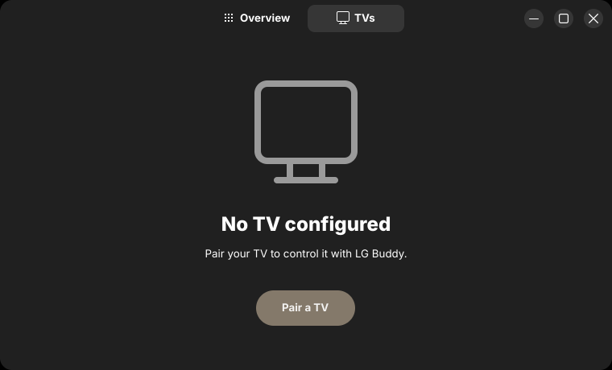
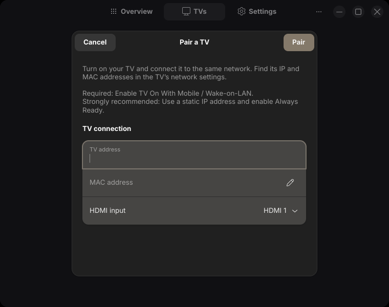
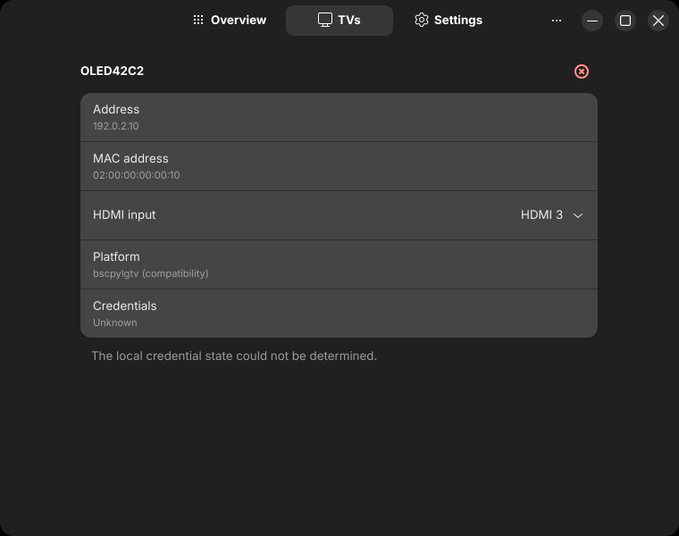
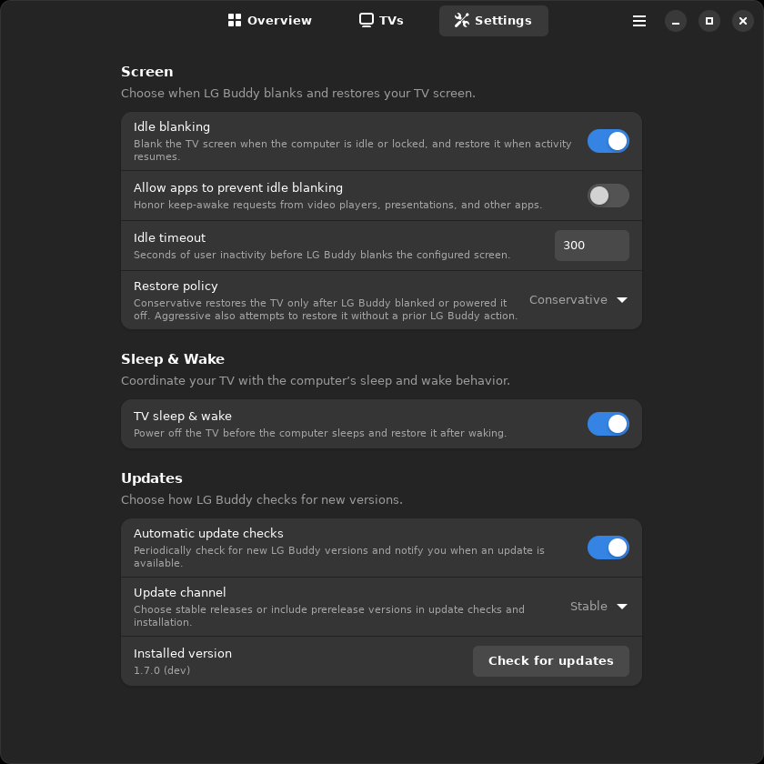

#  LG Buddy User Guide

Use this guide to make your TV comfortable to work on, choose when it blanks
and wakes, and get it working again if something goes wrong. If you are setting
up LG Buddy for the first time, start with the [installation instructions](../README.md#install).

[Open the app](#open-lg-buddy) · [Adjust brightness and sound](#adjust-brightness-and-sound) · [Pair or fix a TV](#tvs) ·
[Choose blanking and wake behavior](#settings) · [Use a terminal](#common-commands) ·
[Updates](#updates)

<a id="desktop-app"></a>
## Open LG Buddy

Open **LG Buddy** from your application launcher, or run `lg-buddy`. With a saved TV, it opens
**Overview**. After a fresh release-bundle install, the app opens directly to
[Pair a TV](#pair-your-first-tv): **TVs** is the only page and the other tabs
are hidden until pairing succeeds. For a keyboard shortcut straight to
brightness, bind `lg-buddy brightness` to your preferred key combination.

LG Buddy manages one TV. Screenshots use sample TV data.

## Adjust brightness and sound

In **Overview**, use the upper slider to adjust OLED pixel brightness and the
lower slider to change volume. Changes take effect as you move each slider.
Click the speaker icon to mute or unmute; changing volume also unmutes the TV.
If a control fails, follow the error message beside it and retry.


<a id="tvs"></a>
## Pair or fix a TV connection

### Pair Your First TV

Open **TVs → Pair a TV**. Before starting, turn on the TV, connect it to the
same network as the computer, and find its IPv4 and MAC addresses. Enable
**TV On With Mobile / Wake-on-LAN** on the TV. A static IP and **Always Ready**
are strongly recommended.



In the dialog:

1. Enter the TV's IP and MAC addresses.
2. Select the HDMI input connected to the computer. This sets the input LG
   Buddy manages.
3. Choose **Pair**, then approve the native webOS pairing request with the
   remote.

Cancel is available until saving starts; once saving starts, the dialog stays
open until the operation finishes. When verification and saving finish, the
dialog closes and normal navigation becomes available. A fresh setup attempts
the default Idle Blanking and TV Sleep & Wake behaviors. There is no separate
confirmation for each service; approve the desktop authorization prompt when a
system operation needs it. Pairing again reactivates previously enabled
behaviors and keeps disabled choices off. If authorization is declined or a
behavior cannot be activated, the paired TV remains saved while that behavior
stays off. Enable it in **Settings** later to retry and activate the service. A
failed pairing shows an error you can correct and submit again; a cancelled
attempt does not save a TV.



Automatic power and idle behavior require the [installed payload](../README.md#install).

### Move the HDMI cable

After moving the cable, open **TVs** and choose the new value in **HDMI input**.
The choice saves immediately and changes which input LG Buddy manages;
you may still need to switch the TV's current source with its remote. If saving
fails, the previous choice is restored.



### Fix a pairing problem

<a id="fix-pairing-problem"></a>
If the TV is disconnected, first check that it is on, on the same network, and
still has the address shown in **TVs**. Also check that **TV On With Mobile /
Wake-on-LAN** is enabled.

If the TV rejects LG Buddy’s authorization, pair it again: open **TVs**, choose
**Unpair TV…** beside the TV name, and confirm. This removes the saved TV details
and local native credential while keeping other settings. It does not revoke
authorization on the TV or remove compatibility credentials.

After unpairing, use **Pair a TV** and approve native webOS pairing again.
Cancelling the unpair confirmation keeps the connection. Cancelling or failing
the new pairing leaves no TV configured.

For installed GUI reconfiguration, use **TVs** to change the HDMI input or
unpair and pair again, and use **Settings** for screen, sleep and wake, desktop
integration, and update preferences. The command-line setup and compatibility
fallback remain available in [headless commands](#common-commands) when the GUI
cannot be used.

<a id="settings"></a>
<a id="automatic-screen-blanking"></a>
## Choose when the TV blanks, sleeps, and wakes

Open **Settings** to adapt the TV to your routine:

- To wait longer before blanking, increase **Screen → Idle timeout**. The value
  is in seconds: `600` gives you ten minutes. The default is five minutes.
- To keep the panel on while you are away, turn off **Idle blanking**.
- To keep the panel on during video playback or presentations, turn on
  **Allow apps to prevent idle blanking**. It is off by default. Apps must
  request that the desktop stay awake; when the last request ends, LG Buddy
  starts a fresh idle timeout. A request does not restore an already blanked
  TV or prevent blanking when you lock the session.
- To stop the TV following PC sleep and wake, turn off
  **Sleep & Wake → TV sleep & wake**. Enable it to power the TV off before
  sleep and restore it after wake.



After blanking the panel for inactivity or a locked session, LG Buddy powers
the TV off after five more minutes without activity. Returning before then
restores the panel.

Leave **Restore policy** at **Conservative** to restore only a TV that LG Buddy
blanked or powered off. Choose **Aggressive** if activity or system wake should
also attempt to restore a TV turned off another way.

Changes save and apply automatically; for **Idle timeout**, press Enter or leave
the field to finish editing. If a change cannot be saved, the previous value is
restored. If it was saved but could not take effect, the value stays saved and
**Retry apply** retries that step. A warning about a missing or inactive service
means its setup needs attention before the saved behavior can take effect;
see [troubleshooting](#troubleshooting).

Leave **Desktop integration** at **Automatic** unless you need to select a
particular compatible desktop. See the [session backend model](session-backend-model.md)
for compatibility details, including the deprecated `swayidle` option.

This preference applies to the native GNOME and Wayland integrations. The
deprecated `swayidle` integration always honors app inhibition, including when
**Automatic** falls back to it. Selecting `swayidle` hides this preference.

Turning off **Idle blanking** hides **Allow apps to prevent idle blanking**,
**Desktop integration**, and **Idle timeout**
while keeping their saved values for when you turn it back on. **Restore policy**
stays available because it also controls restoration after system sleep and
explicit screen-on requests.

<a id="gamepad-activity"></a>
## Keep the screen awake with a gamepad

Supported controller activity counts as normal activity with the GNOME and
native Wayland backends, so no extra setting is needed. With the deprecated
`swayidle` backend, controller activity can restore a screen LG Buddy already
blanked, but it does not reset swayidle's initial timeout.

If a controller is ignored, check that the user running the screen service can
read the controller's Linux input device, then see the [gamepad subsystem
guide](gamepad-subsystem.md) for supported input paths and troubleshooting.

<a id="common-commands"></a>
<a id="configuration"></a>
## Use commands for shortcuts, scripts, or a headless setup

For first-time setup without the GUI, run `./configure.sh` from the extracted
release archive before `./install.sh`. To select native control for an existing
profile and verify it before saving, use `lg-buddy settings set tv.platform
lg_webos`. The explicit `bscpylgtv` value remains a compatibility fallback.

These commands work without opening the GUI:

| Task | Command |
| --- | --- |
| Wake the TV and select the PC's configured input | `lg-buddy power on` |
| Turn off the TV while it is on that input | `lg-buddy power off` |
| Blank the panel | `lg-buddy screen off` |
| Restore the panel using your restore policy | `lg-buddy screen on` |
| Read the current OLED brightness | `lg-buddy brightness get` |
| Set OLED brightness to 65% | `lg-buddy brightness set 65` |
| Set volume to 20 and unmute | `lg-buddy volume 20` |
| Toggle mute | `lg-buddy volume mute` |
| Inspect all settings | `lg-buddy settings list` |
| Explain the selected desktop integration | `lg-buddy settings describe screen.backend` |
| Wait ten minutes before blanking | `lg-buddy settings set screen.idle_timeout 600` |
| Restore the default idle timeout | `lg-buddy settings unset screen.idle_timeout` |

For more commands and accepted values, run `lg-buddy --help` or scoped help such
as `lg-buddy volume --help`. Use `lg-buddy settings describe <KEY>` before
changing an unfamiliar setting; it explains the value, default, and available
choices.

GUI and terminal changes use the same saved configuration. See
[Defaults and configuration](defaults-and-configuration.md) for its location,
format, and compatibility behavior.

<a id="updates"></a>
## Check for and install an update

In **Settings → Updates**, the update row shows the installed version and
**Check for updates**. Checking works even when automatic checks are off and
uses your saved release channel. The button reads **Checking…** and is disabled
until the check finishes. If LG Buddy is current, a brief **Already up to date**
message appears. An available release changes the same row to **Install update…**.
Changing the saved channel requires a fresh check before installation.

Choose **Install update…** to open the update dialog. It retrieves the latest
qualifying release using your saved channel preference, then shows its version,
channel, and release link. This may be a newer release than the one available
when you checked. If no update qualifies, the dialog closes with an **Already up
to date** message. Choose
**Install and restart** to authorize the system installation. Pairing and
settings are preserved. A pulsing progress bar and short status describe the
current work; the installer does not provide a percentage.

You can cancel while preparing or downloading. Once installation starts, keep
LG Buddy open until it finishes. Cancelling authorization leaves the
installation unchanged. Success verifies both installed executables and
restarts into the updated application.

Check and installation errors appear as toasts with **Copy details**. This
copies the explanation and diagnostic text for troubleshooting without a
terminal. A failure after installation changes begin may leave a partial
installation; follow the recovery guidance in those details before retrying.
The installation dialog closes on failure, and **Install update…** offers
another attempt. If installation succeeded but restarting failed, the row
identifies the required restart and its action retries restarting only.

This flow requires a compatible mutable release-bundle installation. Use the
package manager for externally managed installations. Graphical authorization
requires `pkexec` and a desktop authorization agent.

### Headless update commands

The terminal alternatives are:

```bash
lg-buddy updates check
```

To check again and install the offered release, run as your regular user:

```bash
lg-buddy updates install
```

Review the offered version and type `yes` to download, verify, and install it.
Your settings and pairing are preserved. Both commands use your saved update
channel. If the upgrade is refused, follow the reported reason before retrying.

If the installed version predates `v1.4.0-beta.2`, install one updater-capable
release bundle manually before using `updates install`.

## Choose preview releases and automatic checks

In **Settings → Updates**, turn automatic checks on or off and choose the
release channel. Changes apply immediately. `stable` checks stable releases;
`prerelease` also considers published previews. Choosing `prerelease` does not
install anything by itself.

For a terminal-only setup, use one setting at a time:

| Preference | Command |
| --- | --- |
| Enable automatic checks | `lg-buddy settings set updates.auto_check enabled` |
| Disable automatic checks | `lg-buddy settings set updates.auto_check disabled` |
| Use stable releases | `lg-buddy settings set updates.channel stable` |
| Consider preview releases | `lg-buddy settings set updates.channel prerelease` |

<a id="troubleshooting"></a>
## Find your version, report a problem, or troubleshoot

Open **About LG Buddy** from the app menu to see the version, save build
information, and open the project issue form. The terminal equivalent is:

```bash
lg-buddy --version
```

Open **Diagnostics** from the app menu to collect a troubleshooting report,
even before a TV is paired. Use **Refresh** for a new snapshot, **Copy** for the
clipboard, or **Save…** for a text file. The report includes settings, desktop
capabilities, service states, and available failure findings. A failed inspection
leaves the other results available. Collection does not change settings, start
services, or pair a TV.

The report excludes credentials and raw logs, but includes local TV addresses
and configuration details. Review it before sharing. When reporting a problem,
include what you expected, what happened, and the report. These additional
checks include command-line alternatives for headless use:

| Problem | Check |
| --- | --- |
| The TV is disconnected | Check its power, network, saved address, and Wake-on-LAN setting. For rejected authorization, follow [Fix a pairing problem](#fix-pairing-problem). |
| Idle blanking does not work | `lg-buddy settings describe screen.backend`<br>`systemctl --user status LG_Buddy_screen.service`<br>`journalctl --user -u LG_Buddy_screen.service --since today` |
| A setting shows an error | Follow its message, then use **Retry apply** when offered. If a behavior is off after a declined or unavailable activation, enable it again in **Settings** after fixing the reported service or authorization issue. |
| System sleep/wake behavior is wrong | `systemctl status LG_Buddy_lifecycle.service`<br>`journalctl -u LG_Buddy_lifecycle.service --since today` |
| An update cannot be installed | In the GUI, use the update toast's **Copy details** action. For a headless update, keep the complete `updates install` output, confirm the saved channel, and report the installed version from `lg-buddy --version`. |

For deeper behavior and integration details, see [Technical references](#technical-references).

## Technical references

- [Session backend model](session-backend-model.md): desktop idle, activity,
  lock, and wake behavior.
- [Gamepad activity subsystem](gamepad-subsystem.md): device access and
  supported controller paths.
- [Defaults and configuration](defaults-and-configuration.md): settings
  storage, defaults, and compatibility.
- [Runtime event handler map](runtime-event-handler-map.md): service entrypoints
  and lifecycle routing.
- [Architecture overview](architecture-overview.md): runtime and TV integration
  boundaries.
- [Development guide](development.md): building and validating local binaries.

<a id="uninstall"></a>
## Remove LG Buddy

From the extracted release archive, run:

```bash
chmod +x ./uninstall.sh
./uninstall.sh
```

The uninstaller stops LG Buddy’s automatic behavior and removes the app. Keep
the configuration when prompted if you plan to reinstall with the same settings
and pairing. Choosing to remove it also deletes the saved TV details and local
native credential.
