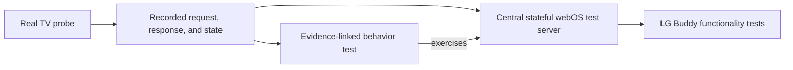

# Native webOS Testing

This document describes how LG Buddy tests its native webOS boundary.

It is implementation guidance, not an attempt to define a general webOS
emulator. The goal is to provide a reliable TV boundary for LG Buddy while
keeping every claimed device behavior traceable to real hardware evidence.

## Confidence Chain



Each step has a distinct responsibility:

- real-TV probes establish what the device actually does
- issue comments preserve the relevant request, response, starting state, and
  resulting state
- characterization tests state the behavior LG Buddy relies on and link to the
  evidence
- the stateful server centralizes complete webOS frames and TV transitions
- higher-level tests use that server to exercise LG Buddy behavior without
  reproducing webOS payloads

`bscpylgtv` remains useful as a source of hypotheses and compatibility clues.
It is not evidence that the native client or mock should copy without a real-TV
observation.

## Test Surfaces

### Central stateful test server

`crates/lg-buddy/src/web_os/test_support/test_server.rs` is the only webOS
server exposed to tests. It owns registration, complete response frames,
permission checks, state transitions, TLS setup, and named protocol-fault
scenarios.

Its stateful TV behavior includes:

- changing the foreground application after an input switch
- applying a picture-backlight Luna callback when its temporary alert closes,
  then exposing the numeric result through a later SSAP read
- moving between `Active` and `Screen Off`
- moving to `Power Off` and rejecting an immediate new registration

Connections share TV state and are served concurrently. Power-off disconnects
existing clients; fixture shutdown also closes clients waiting in a handshake or
for a request. Worker failures are surfaced instead of leaving a healthy-looking
listener behind. The shared-client characterization links to the
[Hearth lifecycle observations][hearth-lifecycle].
Closing sockets at power-off exercises stale-session recovery; it does not
assert the exact time at which hardware closes each connection.

The test-only `simulate_wake` operation restores power without resetting input,
picture/audio settings, credentials or observation counters. It can delay
readiness, rejecting registration until the deadline. That delay and the chosen
temporary rejection are synthetic controls for retry tests: the hardware run
established that restoration can require retries, not an exact readiness timing
or failure frame. Repeated wake requests do not restart that deadline.

The server has exact firmware profiles for observed device behavior:

- `WebOs24Version92261` is the local webOS24 / 9.2.2-61 baseline. It accepts the
  legacy signed envelope and its direct SSAP brightness write, and it also
  accepts the unsigned manifest plus alert-backed Luna route. With the unsigned
  manifest, omitting `WRITE_NOTIFICATION_TOAST` makes `createAlert` return 401.
  See the earlier [direct-SSAP observation][webos24-direct-ssap] and the current
  [unsigned/Luna characterization][webos24-luna].
- `WebOs26Firmware432160` represents external webOS26 / 43.21.60 reports. It
  rejects the legacy signed registration certificate and direct SSAP brightness
  writes, while accepting unsigned registration and the alert-backed Luna
  route. See the external [registration and direct-SSAP report][webos26-direct]
  and [working Luna-route confirmation][webos26-luna].

Picture writes therefore have two modeled service-invocation paths, but not two
network transports:

- direct SSAP sends `ssap://settings/setSystemSettings` over the TV websocket
- alert-backed Luna sends `createAlert` and `closeAlert` over that same
  websocket, with
  `luna://com.webos.settingsservice/setSystemSettings` as the on-TV callback

Production always uses the alert-backed Luna path. It does not probe direct
SSAP, detect firmware, or fall back between paths. The mock retains direct SSAP
only to preserve the observed version difference and to prove that production
does not depend on the path rejected by affected firmware.

Profiles represent observations, not a guessed version range. Production does
not infer behavior for neighboring versions. Named scenarios remain transient
fault injection layered on top of a selected profile.

The server validates the request URI and payload sent by the client before it
responds. Controls mutate server state, and later reads expose that state. This
lets tests verify an operation through an independent observation instead of
only accepting its immediate acknowledgement.

Audio characterization models the observed `CONTROL_AUDIO` permission and the
native `ssap://audio/getStatus`, `audio/setVolume`, `audio/volumeUp`,
`audio/volumeDown`, and `audio/setMute` operations. The protocol fixture changes
only the state addressed by each request; the CLI sends an explicit unmute after
numeric volume changes. A reported volume of `-1` is represented as an unknown
value rather than rejected as malformed. Local hardware validation used the
TV's headphone output; ARC/eARC volume behavior remains unvalidated.

Tests select a firmware profile plus semantic scenarios such as registration
rejection, response timeout, malformed frame, or permission denial. They cannot
author raw server frames. Successful responses, rejected operations, accepted
operations with no state change, and transport failures therefore have the same
response owner.

Whether a behavior was observed on hardware or introduced as defensive fault
injection is documented by the test and its evidence link. Provenance does not
change which server constructs the response.

The server should fail when a test asks for an unmodeled URI, input, or state
combination. Unsupported behavior is intentionally visible;
the mock must not invent a plausible response to make a test pass.

Complete webOS response JSON belongs in this server. Tests may assert domain
values and error details that matter to LG Buddy, but must not create another
server or peer that carries response fixtures.

### Process fixture for desktop/lifecycle validation

Build `gui_journey_tv` with `cargo build -p lg-buddy --example gui_journey_tv`.
It uses the same server, binds WSS on `127.0.0.1:3001`, and publishes atomic
`state.json` snapshots in its control directory. The existing one-argument GUI
journey invocation remains supported. For a dedicated VM's real WoL sender:

```sh
gui_journey_tv /path/to/control 0.0.0.0:9 02:00:00:00:02:17 8000
```

The optional arguments are UDP bind address, test MAC and readiness delay in
milliseconds (default zero). Binding port 9 may require `CAP_NET_BIND_SERVICE`.
Only an exact 102-byte magic packet for that MAC wakes the fixture. It does not
forward packets or control a real TV. `state.json` reports the bound
`wol_address`, so a test can bind port zero and discover its allocated port.

Write commands through an atomic rename to `<control-dir>/command`:

- `wake` or `wake <delay-ms>` wakes a powered-off fixture without resetting it.
- `ready` releases an injected readiness delay without powering on an off TV.
  Tests can keep startup pending until their assertions complete.
- `stateful`, `pairing-rejected`, `stall` and `interrupted` restart the fixture
  with that scenario, preserving the existing GUI journey behavior.
- `stop` closes all connections and exits.

Snapshots include `tv_ready`, current and cumulative connection counts,
`power_off_count` and `wake_count`, alongside the existing TV settings and
registration history. Active connections include pending transport handshakes.
`screen_on` describes TV blanking only; it does not mean that the compositor
supplies an HDMI signal or that a desktop image is visible.

The process smoke uses the real CLI, independent UDP packets and snapshot
assertions. Run with TCP port 3001 free:

```sh
python3 scripts/test-tv-fixture.py target/debug/lg-buddy target/debug/examples/gui_journey_tv
```

It checks power/wake cycles, retained settings and credentials, invalid packets,
delayed readiness, repeated packets and shutdown with an unfinished handshake.

### Characterization tests

`crates/lg-buddy/src/web_os/observed_behavior.rs` exercises the real native
client against the stateful server. These tests define the device contract that
LG Buddy currently relies on.

Each observed behavior test must include a comment linking to the issue or
issue comment that contains its hardware evidence. A useful test states:

- the initial TV state
- the native operation being performed
- the returned domain result or exact meaningful error
- the resulting state, preferably verified by a later read

Registration behavior may be characterized beside the authentication code when
that keeps token persistence and authentication events in the same test. It
must still use the centralized test server and link to its evidence.

### Protocol and fault scenarios

The central server also owns named synthetic scenarios for low-level protocol
mechanics, including:

- malformed JSON frames
- unrelated or incorrect response IDs
- timeouts and early connection closure
- deliberately rejected registration
- responses that contradict observed token behavior

These scenarios exercise the same client boundary without exposing a raw peer
or creating another place where webOS response frames can be assembled.

Pure parser tests remain appropriate for malformed, boundary, and forward-
compatibility values. They do not emulate a TV or define a reusable response
fixture.

### LG Buddy functionality tests

Tests above the webOS module should use the stateful server when native TV
behavior is part of the scenario. These tests should focus on LG Buddy outcomes:
policy decisions, retries, state ownership, command results, and user-visible
behavior. They should not know the normal webOS wire response shape.

The profile-bound native adapter uses the same server to cover the complete
`TvClient` contract, session reuse, transport invalidation, later reconnection,
and ambiguous-write no-replay behavior. The server can also support higher-level
tests of `TvDevice`, command orchestration, and acceptance scenarios. The
characterization suite remains responsible for documenting and guarding the
observed device contract represented by the server.

A passing mock-backed functionality test proves LG Buddy behavior against the
current device model. It is not evidence that an unverified device behavior is
real.

## Adding Or Refining Behavior

Use this sequence when implementing another native webOS operation or learning
about a device quirk:

1. Drive the operation manually against the real TV using the temporary
   `lg-buddy dev webos-auth-probe`, `lg-buddy dev webos-read-probe`, or
   `lg-buddy dev webos-control-probe <operation>` surface, or an equally narrow
   diagnostic.
2. Record the initial state, request, response, and resulting state in the
   relevant GitHub issue. Remove access tokens and other secrets.
3. Add or update an evidence-linked characterization test.
4. Extend the matching exact firmware profile in the centralized stateful
   server with the observed response and state transition. Preserve exact quirks
   when LG Buddy behavior depends on them; do not infer a version range from one
   observation.
5. Add named server scenarios or parser tests for defensive behavior that
   cannot be claimed as an observation.
6. Use the refined server in the LG Buddy functionality tests for the new
   operation.
7. Run the focused webOS tests, then the normal workspace suite.

```bash
cargo test -p lg-buddy --lib web_os
cargo test --workspace
```

If later evidence contradicts the current model, update the evidence-linked
test and server together. Downstream functionality tests should inherit the
refined behavior without changing their own webOS fixtures.

## Transport Boundary

The test server supports local plain WebSocket transport for most behavior
tests and WSS transport for the self-signed certificate test. Both transports
use the same server and response construction.

Keeping transport assertions and device-semantics assertions in distinct tests
makes failures diagnostic: a characterization failure points to device
semantics, while a WSS test failure points to transport setup.

[webos24-direct-ssap]: https://github.com/Staphylococcus/LG_Buddy/issues/52#issuecomment-5183221492
[webos24-luna]: https://github.com/Staphylococcus/LG_Buddy/issues/76#issuecomment-5420796570
[webos26-direct]: https://github.com/JPersson77/LGTVCompanion/issues/351#issuecomment-5277399395
[webos26-luna]: https://github.com/JPersson77/LGTVCompanion/issues/351#issuecomment-5309740894
[hearth-lifecycle]: https://github.com/Staphylococcus/LG_Buddy/issues/217#issuecomment-5647209853

## Review Checklist

For native webOS test changes, check that:

- every claimed device behavior has a hardware evidence link
- complete response fixtures have one home in the stateful server
- controls update state and are verified through a meaningful read when
  possible
- unobserved behavior fails clearly instead of being generalized
- protocol faults are selected through named scenarios on the same server
- higher-level LG Buddy tests assert domain outcomes rather than wire JSON
- access tokens and device-specific secrets are absent from fixtures and logs
